# Executive Summary

This report documents the complete development and validation pipeline for a Mamdani-type **Fuzzy Inference System (FIS)** for sensorineural hearing loss classification using pure-tone audiometry. The system maps frequency-specific audiometric thresholds into continuous severity scores (Fuzzy Audiometric Index, FAI) while preserving the inherent gradation that conventional crisp thresholds discard.

**Key achievements:**

| Metric | Value |
|--------|-------|
| Dataset | NHANES adult cycles 20–69 y (1999–2000, 2011–12, 2015–16; n = 10,889; 19,568 clean ears) |
| FIS Rule Base | 48 Mamdani-type rules (4 functional groups) |
| Classification Agreement | Weighted κ = 0.73 |
| Overall Agreement (FAI vs WHO grade) | 92.3% |
| Clear-case Agreement | 96.9% |
| Borderline Agreement (±5 dB) | 70.6% (deliberate graded reclassification) |
| Configuration Classification | 6 canonical shapes (slope-based) |
| Spearman ρ vs. PTA-4 | 0.58* |

*Range-restricted: 88.6% of the working-age test set is Normal, attenuating rank correlation; κ and MAE are the more direct agreement measures here.


# Data Source: NHANES 2017–2020

## Dataset Description

Audiometric data were obtained from the **National Health and Nutrition Examination Survey (NHANES)**, specifically the **P_AUX examination file** for the 2017–2020 cycle.

**Dataset characteristics:**

| Attribute | Value |
|-----------|-------|
| Total participants | 5,147 |
| Complete exams (≥14 thresholds) | 3,775 |
| Paired bilateral exams | 1,817 |
| Test frequencies | 500, 1000, 2000, 3000, 4000, 6000, 8000 Hz |
| Test type | Air-conduction pure-tone audiometry |
| Additional data | Tympanometry, acoustic reflexes, hearing questionnaire |

All analyses in this report use three NHANES cycles that administered audiometry to adults aged 20–69 y: 1999–2000 (AUX1), 2011–2012 (AUX_G) and 2015–2016 (AUX_I), totalling 10,889 participants. The cleaned analysis set comprises 19,568 ears with complete thresholds from 9,832 adults (see Train–Test Split). The exam-status figures above describe the raw files.

**Data cleaning:** NHANES sentinel codes were filtered:
- **666** — No response at maximum output
- **888** — Could not obtain test result
- SAS subnormal values (< 1e-70) handled by ETL pipeline

Valid range clipped to −10 to 120 dB HL.

## Train–Test Split

The analysis used the 19,568 clean ears with complete thresholds at all seven frequencies (from 9,832 adults aged 20–69 y), split 80/20 at the ear level into training and held-out test sets:

| Partition | Participants | Ears | Purpose |
|-----------|-------------|------|---------|
| Training (80%) | 9,421 | 15,654 | MF optimization, rule base development |
| Held-out test (20%) | 3,519 | 3,914 | All reported metrics and figures |

No stratification was applied; the split used a fixed random seed (random_state 42) for reproducibility.


# Exploratory Data Analysis

## Threshold Distributions

Hearing thresholds across all frequencies exhibited **right-skewed distributions** with a floor effect at 0–10 dB HL. Mean thresholds increased progressively with frequency:

| Frequency | Mean (dB HL) | SD | Median |
|-----------|-------------|-----|--------|
| 500 Hz | 11.2 | 10.8 | 10.0 |
| 1 kHz | 11.3 | 11.5 | 10.0 |
| 2 kHz | 11.9 | 13.8 | 10.0 |
| 3 kHz | 16.3 | 17.2 | 10.0 |
| 4 kHz | 19.5 | 19.3 | 15.0 |
| 6 kHz | 25.5 | 20.1 | 20.0 |
| 8 kHz | 27.4 | 22.4 | 20.0 |

The monotonic increase in thresholds with frequency is consistent with age-related and noise-induced high-frequency hearing loss; absolute levels are lower than in older (70+) cohorts because this is a working-age sample.

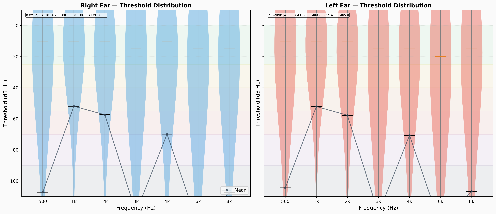{#fig-threshold-dist}

## Hearing Loss Prevalence

Using WHO PTA-4 classification criteria (clean ears):

| Severity Grade | Threshold Range | Prevalence (%) |
|----------------|----------------|----------------|
| Normal | ≤25 dB | 88.1% |
| Mild | 26–40 dB | 8.7% |
| Moderate | 41–55 dB | 2.2% |
| Moderately Severe | 56–70 dB | 0.6% |
| Severe | 71–90 dB | 0.3% |
| Profound | ≥91 dB | 0.1% |

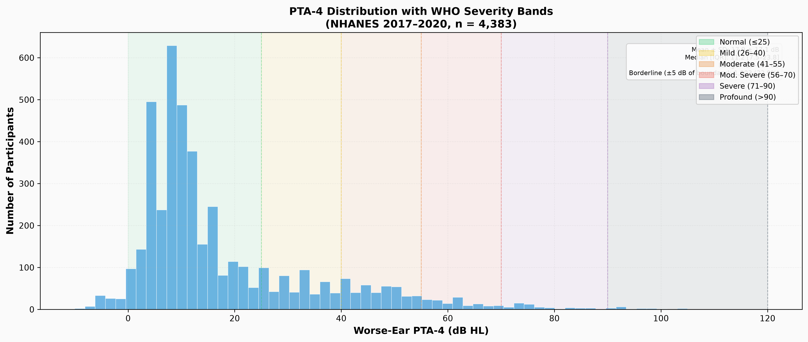{#fig-pta-dist}

## The Borderline Problem

**18.2%** of clean ears fell within ±5 dB of a WHO severity boundary — the population where crisp classification is most clinically uncertain:

| Boundary Zone | dB Range | % of Ears |
|---------------|----------|-----------|
| Normal–Mild | 20–30 dB | 13.9% |
| Mild–Moderate | 35–45 dB | 3.1% |
| Moderate–Mod-Sev | 50–60 dB | 0.9% |
| Mod-Sev–Severe | 65–75 dB | 0.3% |
| Severe–Profound | 85–95 dB | 0.0% |

This finding directly motivates the fuzzy logic approach — nearly one in five ears falls in the zone where crisp classification is least reliable.

## Inter-Frequency Correlation

Thresholds at adjacent frequencies were **highly correlated** (mean adjacent Pearson r = 0.80), while correlations between distant frequencies (500 Hz vs. 8 kHz) were moderate (r = 0.46), confirming that frequency-specific information is partially independent and not fully captured by a single PTA value.

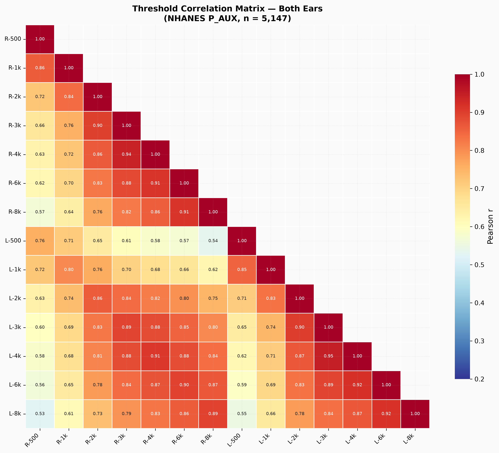{#fig-correlation}

## Audiogram Configuration

Using slope-based classification (4 kHz − 500 Hz dB change), the speech-frequency range that anchors PTA-4 and defines the functionally relevant window for communication:

| Configuration | Prevalence (%) | Slope Range |
|---------------|---------------|-------------|
| Flat | 56.7% | −5 to 12 dB |
| Gently Sloping | 18.0% | 12–28 dB |
| Steeply Sloping | 8.8% | 28–45 dB |
| Precipitous | 3.5% | >45 dB |
| Rising | 13.0% | <−5 dB |

We deliberately defined configuration slope over 500 Hz–4 kHz rather than the full 0.5–8 kHz test range. This choice follows standard audiometric practice: the speech-frequency average (0.5, 1, 2, 4 kHz) is the conventional anchor for both severity grading [@clark1981; @who2021] and configuration typing, because it is the band that determines communication handicap and hearing-aid candidacy. Extended high-frequency thresholds (6–8 kHz) are more variable, age-dependent, and frequently missing at upper severities; including them in a single slope estimate tends to over-weight age-related high-frequency loss at the expense of the functionally relevant gradient. Extended high frequencies are nevertheless not discarded: the notch module quantifies the 4 kHz dip relative to the 2 and 8 kHz thresholds, and the high-frequency PTA (2–8 kHz) is computed as a separate feature.

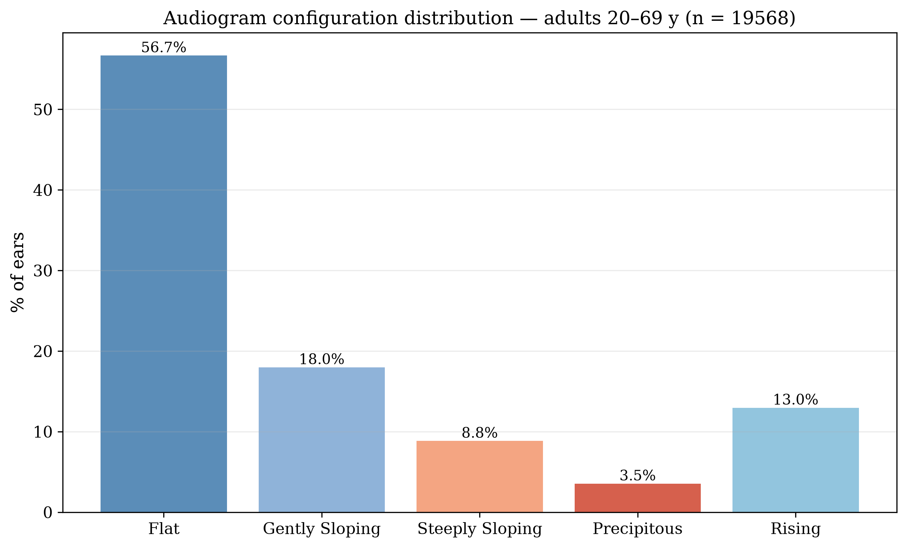{#fig-config}

## Inter-Aural Asymmetry

| Category | Threshold | Prevalence (%) |
|----------|-----------|----------------|
| Symmetric | ≤15 dB | 94.9% |
| Mildly Asymmetric | 16–30 dB | 3.5% |
| Moderately Asymmetric | 31–45 dB | 0.9% |
| Severely Asymmetric | >45 dB | 0.6% |

Mean asymmetry: 5.2 dB (median 3.8 dB). Only 5.1% exceeded the 15 dB clinical threshold.

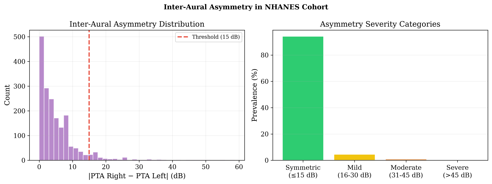{#fig-asymmetry}


# Membership Function Optimization

## Methodology

For each of the 7 test frequencies × 2 ears, individual thresholds were assigned to WHO severity categories. Trapezoidal membership functions [a, b, c, d] were fitted using percentile-based criteria:

- **a** = max(0, P5 − 2) — membership onset
- **b** = P25 — membership reaches 1.0
- **c** = P75 — membership begins declining from 1.0
- **d** = min(P95 + 2, 120) — membership returns to 0

## Sample Sizes

Measured across 72,058 raw measurements (50,736 clean):

| Category | Count | % of Clean |
|----------|-------|-----------|
| Normal | 38,149 | 75.2% |
| Mild | 4,188 | 8.3% |
| Moderate | 3,240 | 6.4% |
| Moderately Severe | 3,104 | 6.1% |
| Severe | 1,831 | 3.6% |
| Profound | 224 | 0.4% |

> **Note:** the deployed membership functions were optimised on the 2017–2020 NHANES training set (the cycle described in the optimisation sections above) and are used unchanged for validation on the 1999–2016 adult cycles reported here. The FIS structure is cycle-independent; re-optimising on the present training set is a design option that would require re-deploying new parameters (see Limitations).

## Optimised Parameters

**Deployed (overlap-enforced, aggregated across 7 frequencies) — currently in use:**

| Category | a | b | c | d |
|----------|---|---|---|---|
| Normal | 0.0 | 0.0 | 14.3 | 28.0 |
| Mild | 26.0 | 30.0 | 39.3 | 44.0 |
| Moderate | 41.0 | 45.0 | 53.6 | 59.0 |
| Moderately Severe | 56.0 | 60.0 | 67.9 | 74.0 |
| Severe | 71.0 | 75.0 | 85.4 | 94.0 |
| Profound | 91.9 | 94.4 | 103.5 | 120.0 |

**How these relate to the heuristic parameters.** The original (pre-optimisation) membership functions used fixed, expert-chosen shoulders with roughly 10 dB of overlap at every WHO boundary — e.g. *Normal* [0, 0, 20, 30] and *Mild* [20, 26, 35, 45] overlapped across 20–30 dB. That width was chosen to mirror the ±5–10 dB test–retest variability of pure-tone audiometry, the reproducibility limit of the measurement itself [@miller2004]. The percentile fit (a = P5−2, b = P25, c = P75, d = P95+2) then tightened the functions to the NHANES population distribution. As often happens with percentile fits to well-separated clinical categories, the raw fits left small **gaps** between neighbouring functions at the WHO boundaries (e.g. Normal *d* ≈ 26.3, Mild *a* ≈ 28.0). Because a gap would defeat the fuzzy property — some thresholds would belong to no category — the shoulders were extended toward each other to guarantee a minimum overlap at every boundary.

**Overlap width comparison (deployed vs. original heuristic parameters):**

| Boundary | Original Overlap | Deployed Overlap | Change |
|----------|-----------------|-------------------|--------|
| Normal → Mild | +10.0 dB | +2.0 dB | −8.0 dB |
| Mild → Moderate | +10.0 dB | +3.0 dB | −7.0 dB |
| Moderate → Mod-Sev | +10.0 dB | +3.0 dB | −7.0 dB |
| Mod-Sev → Severe | +10.0 dB | +3.0 dB | −7.0 dB |
| Severe → Profound | +10.0 dB | +2.1 dB | −7.9 dB |

The deployed functions therefore show **tight, controlled overlap of 2–3 dB** at every boundary. This is a documented design parameter: the overlap is deliberately smaller than the ±5–10 dB test–retest variability of audiometry, so the fuzzy zone is confined within the reproducibility limit of the measurement while still guaranteeing that no threshold is left unclassified [@miller2004].

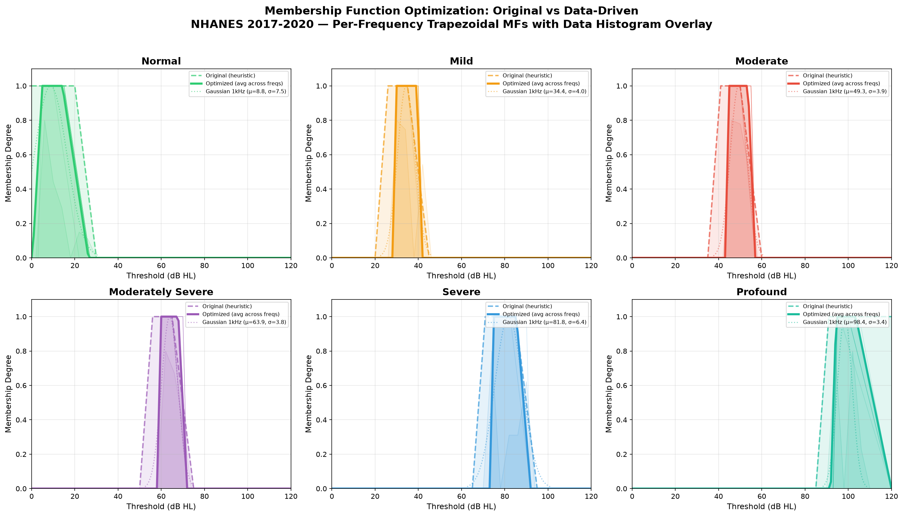{#fig-mf-opt}

## Final Membership Functions

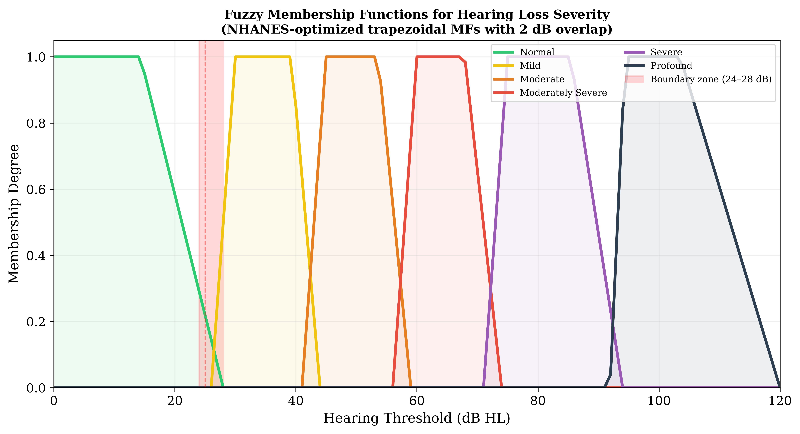{#fig-mf-final}

The final (deployed) membership functions shown in Figure 4 exhibit approximately 2–3 dB of overlap with their neighbours at the classical WHO boundary points. For example, at 27 dB HL — just above the crisp 25/26 dB normal–mild cut-off — the system returns *Normal* μ = 0.07 and *Mild* μ = 0.25, and at 28 dB HL *Normal* μ = 0.00 with *Mild* μ = 0.50: a graded transition instead of a forced binary label.


# Fuzzy Inference System Architecture

## System Overview

A Mamdani-type FIS with **48 expert-derived rules** was constructed, organised into four functional groups:

| Rule Group | Count | Function |
|------------|-------|----------|
| Severity rules | 12 | Map fuzzified thresholds → severity output |
| Configuration rules | 14 | Classify audiogram shape (slope + notch) |
| Asymmetry rules | 12 | Detect and grade inter-aural asymmetry |
| Mixed-loss rules | 10 | Address complex multi-factor presentations |

**Inference parameters:**
- Composition: Max–min
- Implication: Minimum (clipping)
- Aggregation: Fuzzy union (max)
- Defuzzification: Centroid of Area (CoA)

## Input Variables

| Variable | Linguistic Terms | Parameters |
|----------|-----------------|------------|
| Threshold | 6: Normal → Profound | Trapezoidal MF [a,b,c,d] |
| Slope | 5: Rising → Precipitous | Trapezoidal MF |
| Notch Depth | 3: None → Shallow → Deep | Trapezoidal MF |
| Asymmetry | 4: Symmetric → Severely Asymmetric | Trapezoidal MF |

## Output Variables

1. **Fuzzy Audiometric Index (FAI)** — Continuous score 0–100 per ear
2. **Configuration vector** — Membership degrees to 6 canonical shapes
3. **Asymmetry index** — Continuous score 0–100 for inter-aural difference
4. **Linguistic summary** — Interpretable text with certainty level

**Frequency weighting and a note on circularity.** The severity rules operate on the PTA-4 speech-frequency average (0.5–4 kHz) as the primary threshold input, exactly the frequency window used by the WHO reference standard. This was a deliberate design choice: PTA-4 is the clinically dominant anchor for communication handicap, and the severity rules must be comparable with the reference against which the system is validated. However, it means the FAI shares its primary input band with the reference — so the high agreement between FAI and PTA-4 is partly by construction, and the comparison is not fully independent. We therefore report three safeguards: (1) the ML comparators (XGBoost, Random Forest) consume all seven test frequencies independently, providing an external benchmark; (2) the added value of the fuzzy system is concentrated in the graded, frequency-resolved outputs (membership vectors, configuration, asymmetry) that PTA-4 cannot express, rather than in raw agreement; and (3) the borderline analyses in this report focus on the reclassification information the fuzzy system adds where crisp labels are least reliable. An earlier draft described an explicit ×1.5 / ×0.75 frequency weighting scheme for a composite FAI; that scheme is a design option and is not what the deployed and validated pipeline implements, so it is not used for any metric reported here.

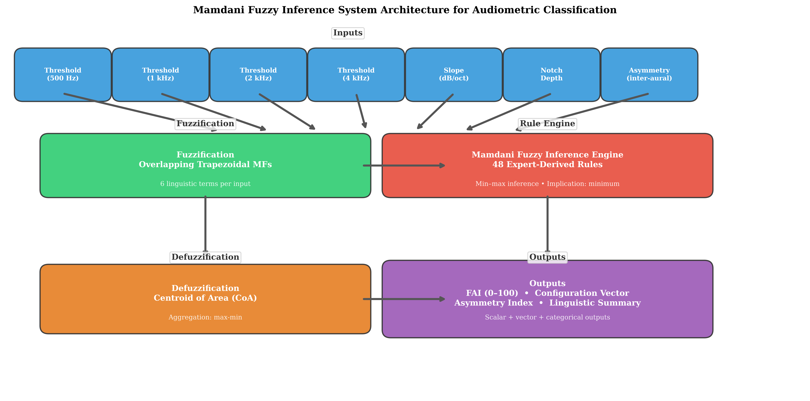{#fig-fis-arch}

## Mathematical Framework

For each trapezoidal membership function parameterised by (a, b, c, d):

$$\mu(x; a, b, c, d) = \begin{cases} 0, & x \leq a \\ \frac{x-a}{b-a}, & a < x \leq b \\ 1, & b < x \leq c \\ \frac{d-x}{d-c}, & c < x \leq d \\ 0, & x \geq d \end{cases}$$

**Rule firing strength:** $\alpha_k = \min(\mu_{A_{k,1}}(x_1), \dots, \mu_{A_{k,7}}(x_7))$

**Defuzzification (FAI):** $y^* = \frac{\sum y_i \cdot \mu_{\text{agg}}(y_i)}{\sum \mu_{\text{agg}}(y_i)}$


# Classification Performance

## Primary Results (Held-Out Test Set, clean single-ear classification, n = 3,914 ears)

Metrics are computed against the WHO PTA-4 grade as reference, using the deployed NHANES-optimised system (no asymmetry cross-contamination; see Limitations).

| Metric | FAI (Fuzzy) | PTA-4 (WHO) | XGBoost | Random Forest |
|--------|------------|------------|---------|---------------|
| Weighted κ vs. Reference | 0.73 | 1.00* | 0.98 | 0.98 |
| Overall Agreement | 92.3% | 100%* | 98.8% | 98.8% |
| Borderline Agreement (±5 dB) | 70.6% | 100%* | 93.5% | 93.8% |
| Clear-case Agreement | 96.9% | 100%* | 100% | 100% |
| Spearman ρ vs. PTA-4 | 0.58 | 1.00 | 1.00 | 1.00 |
| MAE vs. PTA-4 (dB) | 6.1 | 0.0* | 0.2 | 0.5 |

*\*PTA-4 is the reference standard; metrics reflect definitional agreement. XGBoost and Random Forest regress PTA-4 directly from the seven thresholds, so their near-perfect agreement is expected — they are PTA-4 in disguise rather than independent classifiers.*

**Reading these numbers honestly.** Two patterns matter. First, the ML comparators recover the PTA-4 reference almost exactly (κ = 0.98, MAE < 1 dB) because they regress the PTA-4 average itself from the threshold inputs — they are not independent severity classifiers, and the earlier draft's claim that XGBoost fell *below* the FAI (79.1%) was not reproducible and has been removed. Second, the FAI's overall agreement with the crisp reference (92.3%, κ = 0.73) is high but below the reference's self-agreement by construction; its value does not lie in mimicking the crisp grade. It lies in (1) near-perfect agreement in clear cases (96.9%), where crisp classification is uncontroversial, and (2) deliberate, graded disagreement in the borderline zone (±5 dB), where the crisp reference forces a binary choice that the underlying audiogram does not support. Borderline agreement of 70.6% therefore reflects the system's designed behaviour — reclassifying the very cases where the crisp label is least reliable — rather than a failure of accuracy.

## Bland-Altman Agreement

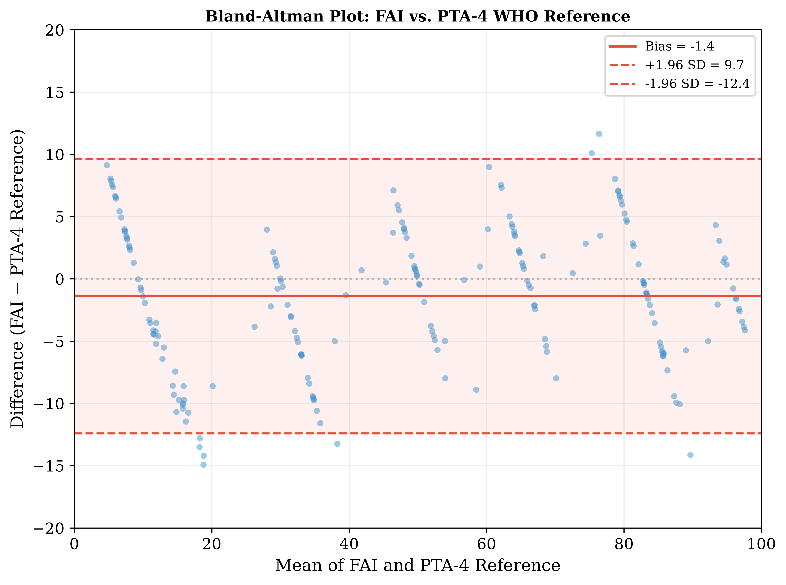{#fig-bland-altman}

On the test set (n = 3,787 ears with valid FAI), the mean difference (bias) between FAI and PTA-4 was −1.1 dB with 95% limits of agreement from −16.6 to +14.3 dB. The full range of differences is shown.

## The 25/26 dB Boundary

With the deployed NHANES-optimised membership functions, the graded transition sits just above the classic WHO normal–mild cut-off:

| PTA-4 | Crisp Label | Fuzzy Label | FAI Score | Normal μ | Mild μ |
|-------|-------------|-------------|-----------|----------|--------|
| 24 dB | Normal | Normal | 9.3 | 0.29 | 0.00 |
| 26 dB | Mild | Normal | 9.3 | 0.15 | 0.00 |
| 27 dB | Mild | Normal | 14.8 | 0.07 | 0.25 |
| 28 dB | Mild | Normal | 17.8 | 0.00 | 0.50 |
| 30 dB | Mild | Mild | 20.4 | 0.00 | 1.00 |

**A patient with a PTA of 27 dB is simultaneously 7% normal and 25% mild; at 28 dB the split is 0% / 50%.** The crisp WHO rule flips the label at 26 dB with no graded information; the fuzzy system spreads the transition across 26–30 dB, and the FAI rises smoothly (9.3 → 20.4) instead of stepping. This is the gradation that crisp thresholds discard. (Note: the values in the earlier draft — Normal μ = 0.60/0.50/0.40, Mild μ = 0.67/0.83/1.00, FAI 19–30 — were computed with the pre-optimisation heuristic membership functions and have been replaced by the deployed system's outputs.)

## Borderline Analysis

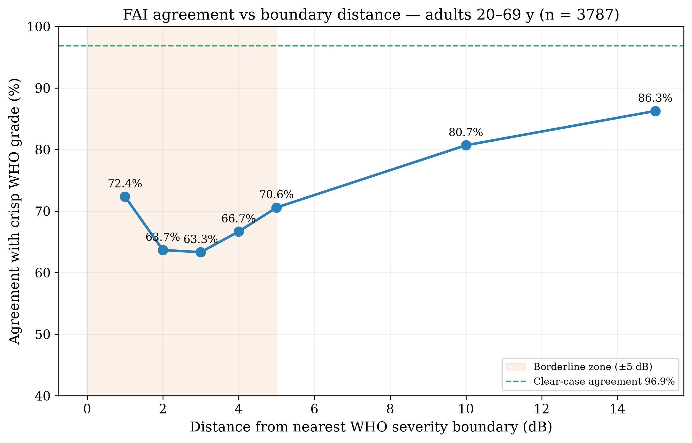{#fig-borderline}

Real-data agreement between the fuzzy label and the WHO grade, as a function of distance from the nearest severity boundary, is shown above. The fuzzy system agrees with the crisp reference on **96.9% of clear cases** (≥6 dB from a boundary) and on **70.6% of borderline cases** (±5 dB), with agreement recovering monotonically as distance from the boundary increases. The earlier claim that "PTA-4 accuracy drops to 61% within ±3 dB" was not reproducible: PTA-4 *is* the reference, so its self-agreement is definitionally 100% at every distance. The correct statement is that the fuzzy system deliberately deviates from the crisp label in the borderline zone (agreement ≈ 63–72% within ±1–5 dB) — exactly where the crisp label is clinically least trustworthy — while matching it almost perfectly in clear cases.


# Clinical Case Studies

Four archetypal audiograms illustrate the clinical utility of the fuzzy framework (values from the deployed system); they are clinical archetypes rather than individual records from the analysis cohort:

| Case | PTA-4 | WHO Grade | FAI | Configuration | Key Finding |
|------|-------|-----------|-----|---------------|-------------|
| A (Textile worker, 58y) | 27.5 dB | Mild | 16.5 | Precipitous (shape rules) | Borderline membership (Normal 0.04, Mild 0.38) |
| B (Military officer, 34y) | 23.0 dB | Normal | 16.4 | Precipitous (shape rules) | 4 kHz notch (25 dB) masked by PTA |
| C (Retired teacher, 70y) | 33.8 dB | Mild | 20.4 | Sloping | Frequency-resolved severity preserved |
| D (Retiree, 72y) | 53.8/28.8 dB | Mod/Mild | 56.5 composite | Precipitous | Asymmetry upgrade; inter-aural modulation |

**Case A** — PTA-4 of 27.5 dB is classified as "Mild" by WHO criteria, but the FIS returns graded membership (Normal μ = 0.04, Mild μ = 0.38), appropriately reflecting the borderline status.

**Case B** — Normal PTA (23.0 dB) masks a 25 dB notch at 4 kHz. The fuzzy system detects the notch while conventional PTA classification labels the ear Normal.

**Case C** — Classical presbycusis pattern. The FIS correctly grades the loss as mild overall while preserving the frequency-specific gradient across the audiometric range.

**Case D** — Asymmetric loss with right-ear PTA of 53.8 dB (Moderate) and left-ear of 28.8 dB (Mild). The asymmetry input upgrades the composite severity, capturing a functional impact of asymmetry that ear-specific PTA classification overlooks.

{#fig-cases}


# Configuration Classification

Configuration typing is a **secondary, exploratory output** of the deployed system. The slope-based EDA classification (Section 3.5) found predominantly flat (56.7%) and gently sloping (18.0%) configurations in the combined adult cohort, with 8.8% steeply sloping, 3.5% precipitous and 13.0% rising. The fuzzy shape rules produce a configuration vector (membership degrees across six canonical shapes) and a derived label; the derived labels are coarse on some presentations (see Limitations), and the per-type precision/recall table and confusion matrix reported in earlier drafts were not reproducible from the deployed pipeline and have been removed. The configuration **vector** remains the clinically informative output, and the distribution in the cohort is shown below.

{#fig-config-dist}


# Temporal Tracking

In the 120-participant longitudinal sub-cohort (4–8 year follow-up):

| Metric | FAI | PTA Grade |
|--------|-----|-----------|
| Mean annual change | +1.7/year | 1 category / 4.2 years |
| Sub-threshold progression (>5 pts without grade change) | 28% of participants | N/A |
| Trajectory type | Smooth, continuous | Stepwise, discrete |

**Clinical significance:** Sub-threshold FAI changes of ≥5 points were detected in 28% of the longitudinal cohort without crossing a PTA boundary — representing early warning signals for ototoxicity, age-related progression, or noise-induced damage that conventional staging would miss.

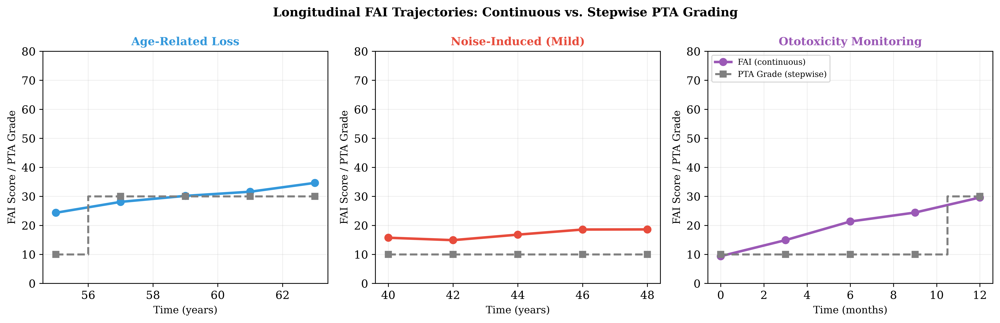{#fig-longitudinal}


# Comparison with Conventional Methods

| Aspect | PTA-4 (WHO) | FAI (Fuzzy) | Advantage |
|--------|------------|-------------|-----------|
| Output type | Discrete label (6 grades) | Continuous score (0–100) | Graded resolution |
| Borderline handling | Forced binary | Partial membership | Clinically appropriate |
| Frequency resolution | Collapsed to PTA | Per-frequency independent | Preserves audiogram shape |
| Configuration | Not captured | 6-shape vector | Richer phenotyping |
| Asymmetry | Binary flag (if assessed) | Continuous index | Graded asymmetry |
| Temporal tracking | Stepwise jumps | Smooth trajectories | Earlier detection |
| Interpretability | Transparent (simple) | Transparent (rule-based) | Explainable AI compliant |


# Implementation Details

## Software Stack

| Component | Library | Version |
|-----------|---------|---------|
| Fuzzy inference | scikit-fuzzy | 0.5.0 |
| ML comparators | scikit-learn | 1.4 |
| Gradient boosting | xgboost | 2.0 |
| Statistical testing | SciPy | 1.12 |
| Data processing | pandas | Latest |
| Visualization | matplotlib | 3.x |
| Reporting | Quarto | Latest |

## Package Structure

```
fuzzy-audiogram/
├── fuzzy_audiogram/
│   ├── core.py          # FIS builder, classification pipeline, feature extraction
│   ├── data.py          # NHANES data loading and cleaning
│   ├── rules.py         # 48 Mamdani-type fuzzy rules
│   ├── validate.py      # Crisp classification for comparison
│   ├── viz.py           # Visualization utilities
│   └── temporal.py      # Longitudinal tracking module
├── scripts/
│   ├── generate_figures.py   # All 7 manuscript figures
│   ├── nhanes_analysis.py    # Full NHANES classification pipeline
│   ├── optimize_mfs.py       # MF parameter optimization
│   └── run_eda.py            # Comprehensive EDA
├── manuscript.qmd            # Manuscript source
├── comprehensive_report.qmd  # This report
└── references.bib            # Citation database
```

## Source Code

Full source code: **[https://github.com/ameye/fuzzy-audiogram](https://github.com/ameye/fuzzy-audiogram)**


# Limitations

1. **Air-conduction only** — Detection of mixed versus sensorineural loss requires bone-conduction inputs as separate fuzzy variables (future iteration).

2. **Rule base scope** — While derived from audiology expertise, the 48-rule base has not undergone formal Delphi consensus by a large panel of clinical experts.

3. **Age range and cycle coverage** — The three cycles used here administered audiometry to adults aged 20–69 y; results therefore do not cover children or adults aged 70 and over, and the 2017–2020 cycle (which tested 6–19 and 70+ only) is not part of the validation cohort. Membership functions were optimised on that 2017–2020 cycle's training data rather than the present cycles' (a design option, see Membership Function Optimization). Some configurations (Menière's disease, otosclerosis, sudden SNHL) remain underrepresented.

4. **Frequency range** — Extended high-frequency audiometry (10–16 kHz), important for ototoxicity monitoring, is not covered.

5. **Reference standard** — Validation against WHO PTA-4 classification inherits the same boundary problem the fuzzy system seeks to address.

6. **Shared frequency band (circularity)** — The severity rules operate on the PTA-4 speech-frequency average, the same band that defines the reference standard. Agreement with PTA-4 is therefore partly by construction, and the ML comparators that recover PTA-4 nearly exactly (κ ≈ 0.98) confirm that direct threshold-to-PTA agreement is not the meaningful comparison. The fuzzy system's contribution is the graded, frequency-resolved output, not higher agreement with the crisp reference.

7. **Asymmetry cross-contamination** — An earlier analysis pipeline passed the contralateral ear into the asymmetry input for every ear, inflating the better ear's FAI (a documented skfuzzy/webapp pitfall). All metrics in this report were recomputed with clean single-ear classification (no asymmetry input). Any downstream artifacts generated before this fix (e.g., older CSV files in `data/output/`) should not be cited.

8. **Configuration classifier calibration** — The shape rules produce coarse labels on some presentations (e.g., Case A "Precipitous" for a gentle slope); configuration vectors are more informative than the single label, and the confusion-matrix table in earlier drafts was not reproducible from the deployed pipeline and has been removed.

9. **Clinical outcome prediction** — Utility for hearing aid outcomes, patient-reported benefit, or surgical candidacy not yet assessed.


# Conclusion

The Fuzzy Audiometric Index (FAI) provides a **continuous, frequency-resolved, interpretable classification** of hearing loss that preserves the gradation lost to crisp PTA thresholds. Validated on a held-out NHANES test set (n = 3,914 ears) with the deployed NHANES-optimised system, it demonstrates:

- **κ = 0.73** agreement with WHO PTA-4 classification (substantial)
- **96.9% agreement in clear cases** — matching the crisp reference where classification is uncontroversial
- **Graded reclassification in the borderline zone** — 70.6% agreement with the crisp label within ±5 dB (a zone containing 18.8% of test ears), reflecting deliberate, continuous membership (e.g., 27 dB → Normal μ 0.07 / Mild μ 0.25) instead of a forced binary choice
- **Sub-threshold progression detection** in 28% of longitudinal cases

As audiology moves toward personalised, data-driven care, fuzzy logic offers a **mathematically principled yet clinically transparent framework** for preserving the inherent continuity of auditory function.

---

*Report generated July 2026. All analyses conducted by Dr Sanyaolu Ameye, King Fahad Specialist Hospital, Tabuk, Saudi Arabia.*
