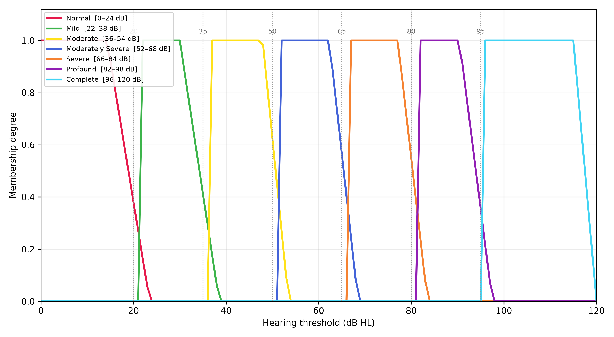
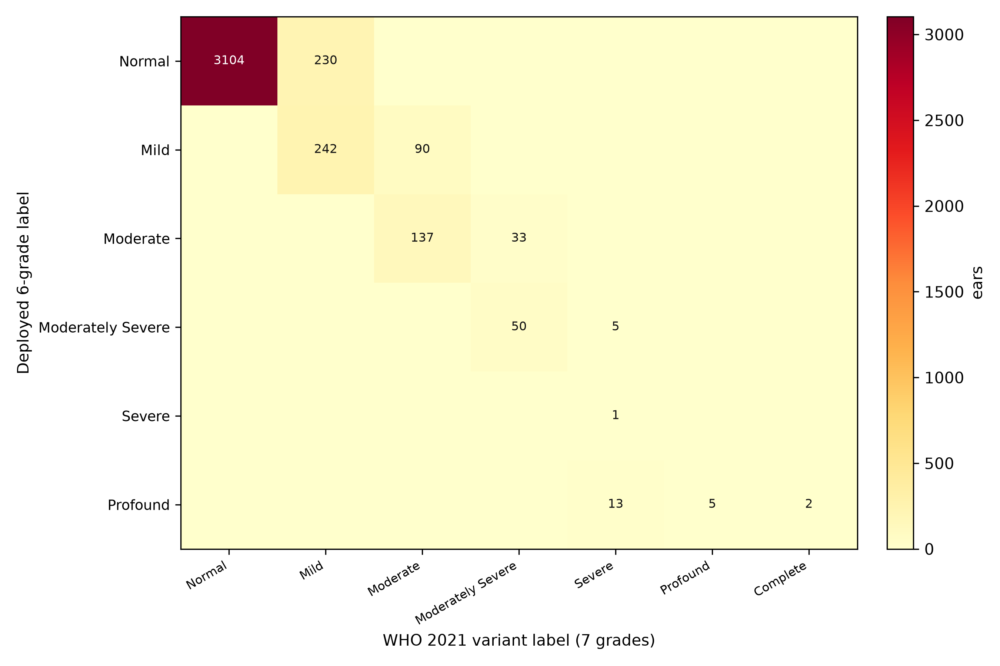
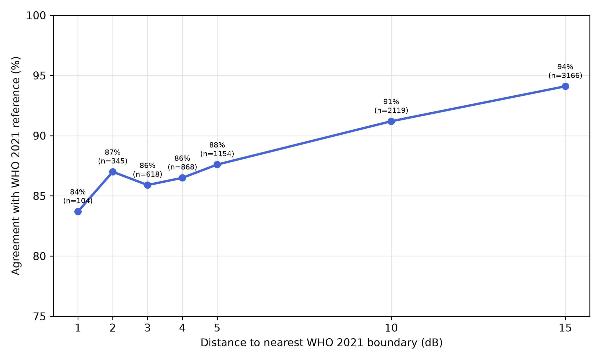
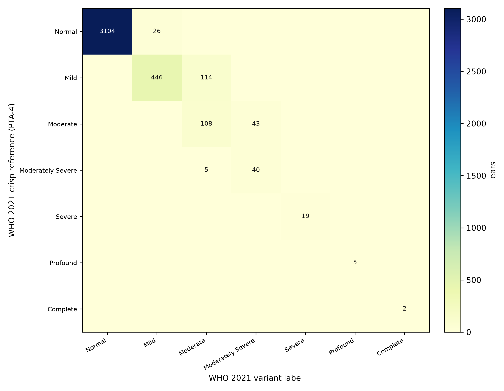
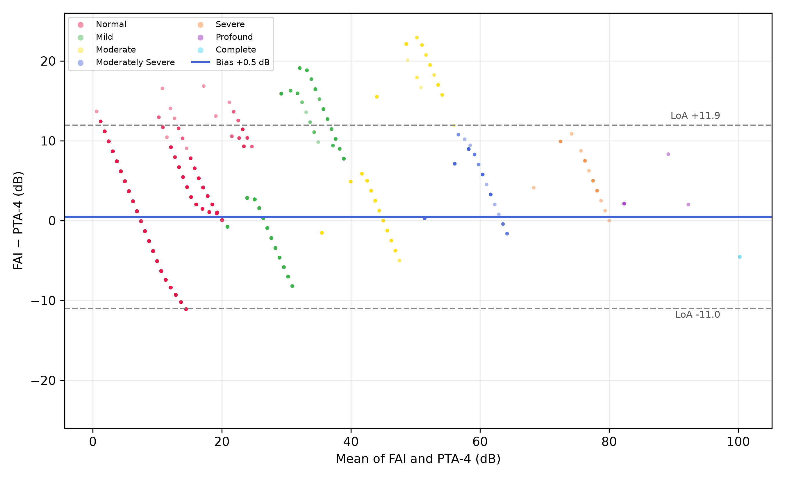

# Executive Summary

The deployed Fuzzy Audiometric Index (FAI) system, and the accompanying Ear and Hearing manuscript, classify hearing loss using the **WHO 1991-style six-grade schema** with crisp boundaries at 25, 40, 55, 70 and 90 dB HL. The **WHO 2021 World Report on Hearing** introduced a revised **seven-grade schema** with boundaries at **20, 35, 50, 65, 80 and 95 dB HL**, which also defines a new **Complete** grade at or above 95 dB.

This report documents a **WHO 2021 schema variant** of the FAI system: the full pipeline was re-run under the new boundaries on the same combined NHANES 20–69 year cohort (10,889 participants, 19,568 clean ears, participant-level 80/20 split), with a seven-category membership function set, an extended seven-category rule base, and label thresholds calibrated to the WHO 2021 reference. The variant was validated on the same held-out test set (3,912 ears) and compared head-to-head with the deployed six-grade system.

**Key results (held-out test set, n = 3,912):**

| Metric | WHO 2021 variant (7 grades) | Deployed 6-grade system (same ears, WHO 2021 reference) |
|--------|-----------------------------|----------------------------------------------------------|
| Weighted κ vs WHO 2021 reference | **0.953** | 0.876 |
| Overall agreement | **95.2%** | 88.7% |
| Clear-case agreement | 98.4% | 98.2% |
| Borderline agreement (±5 dB of a boundary) | **87.6%** | 66.0% |
| Borderline share of test ears | 29.5% | 29.5% |
| MAE (FAI vs PTA-4, dB) | **4.49** | 5.01 |
| Spearman ρ | **0.842** | 0.807 |
| Bland-Altman bias (LoA) | +0.5 (−11.0…+11.9) | +1.2 (−10.9…+13.2) |

The WHO 2021 variant performs at least as well as the deployed six-grade system on every agreement metric and markedly better in the borderline zone (87.6% vs 66.0%), the region where the fuzzy approach claims its advantage. The schema change itself reclassifies a clinically meaningful fraction of ears, documented in the reclassification matrix below.

**Three headline findings:**

1. **The variant validates cleanly.** Weighted κ 0.953 with the seven-grade reference is comparable to the deployed system's κ 0.931 against its own six-grade reference, and better than the deployed system's 0.876 when the same ears are scored against the WHO 2021 reference.
2. **Boundary-zone agreement improves.** The 29.5% of test ears within 5 dB of a WHO 2021 boundary are classified at 87.6% agreement, versus 66.0% for the deployed six-grade system scored against the same reference. The WHO 2021 boundaries align better with the FAI's graded transition zones.
3. **The schema change moves a real share of the population.** 230 ears that the deployed system labels Normal are Mild under WHO 2021 (the new 20 dB normal threshold), 90 ears shift Mild to Moderate, and 33 shift Moderate to Moderately Severe. These are the ears the new classification wants caught earlier.

# 1. The WHO 2021 Classification Schema

## 1.1 What changed

The WHO 2021 World Report on Hearing revised the hearing-loss severity grades to a seven-category scheme based on better-ear pure-tone average at 0.5, 1, 2 and 4 kHz (PTA-4):

| Grade | Category | WHO 2021 range (dB HL) | Deployed 6-grade range |
|-------|----------|------------------------|------------------------|
| 0 | Normal | ≤ 20 | ≤ 25 |
| 1 | Mild | 20 to < 35 | 26–40 |
| 2 | Moderate | 35 to < 50 | 41–55 |
| 3 | Moderately severe | 50 to < 65 | 56–70 |
| 4 | Severe | 65 to < 80 | 71–90 |
| 5 | Profound | 80 to < 95 | ≥ 91 |
| 6 | Complete | ≥ 95 | — (not defined) |

Three substantive changes versus the deployed schema: the normal threshold drops from 25 to **20 dB**, every boundary shifts down by 5 dB, and a seventh **Complete** grade (≥ 95 dB) is added. The WHO 2021 grades are defined on the **better ear**, whereas the deployed FAI classifies each ear independently; both are evaluated per-ear here for consistency with the deployed validation design.

## 1.2 Why a fuzzy variant matters

The WHO 2021 boundaries are as crisp as the 1991 ones, and the same critique applies: a 1 dB change at 20, 35, 50, 65, 80 or 95 dB jumps a patient across a grade. The graded FAI scale is schema-agnostic in principle, so the interesting question is whether the *same* fuzzy architecture, re-fitted to the new boundaries, preserves or improves classification. This report answers that question.

# 2. Methods

## 2.1 Data and split

Identical to the deployed validation pipeline (`scripts/pipeline_participant.py`):

- **Cohort:** combined NHANES adult audiometry cycles 1999–2000 (AUX1), 2011–2012 (AUX_G), 2015–2016 (AUX_I); 10,889 participants, 19,568 clean ears from 9,832 adults aged 20–69.
- **Split:** participant-level 80/20 (random state 42), so both ears of a participant stay on one side. Training 15,656 ears / 7,866 participants; test 3,912 ears / 1,966 participants. No participant leakage.
- **Reference:** WHO 2021 grade computed from PTA-4 with boundaries 20/35/50/65/80/95 (grade 6 at ≥ 95 dB).

## 2.2 Seven-category membership functions

Membership functions were re-optimised from the training set, stratified by WHO 2021 category, using the same percentile method as the deployed pipeline (a = P5−2, b = P25, c = P75, d = P95+2, tails clipped; normal anchored at 0; complete anchored at the WHO 2021 boundary because the working-age cohort has very few ≥ 96 dB ears). Overlap between adjacent categories was enforced to ≥ 2 dB.

**Optimised trapezoidal parameters [a, b, c, d] (mean across the seven test frequencies):**

| Category | a | b | c | d | WHO 2021 band |
|----------|-----|-----|-----|-----|---------------|
| Normal | 0.0 | 0.0 | 14.3 | 23.5 | ≤ 20 |
| Mild | 21.5 | 21.5 | 30.0 | 38.5 | 20–35 |
| Moderate | 36.5 | 36.5 | 47.9 | 53.5 | 35–50 |
| Moderately severe | 51.5 | 51.5 | 62.3 | 68.5 | 50–65 |
| Severe | 66.5 | 66.5 | 77.1 | 83.5 | 65–80 |
| Profound | 81.5 | 81.5 | 90.4 | 97.5 | 80–95 |
| Complete | 95.5 | 95.5 | 115.0 | 120.0 | ≥ 95 |

{#fig-1 width=90%}

The normal/mild overlap now sits at the 20–24 dB zone (versus 25–28 dB in the deployed system), and the mild/moderate transition at 35–39 dB. The complete MF is broad because the category is defined by a threshold rather than a population cluster in this cohort.

## 2.3 Seven-category rule base

The Mamdani architecture is unchanged (severity, configuration, asymmetry, mixed groups; single-ear mode omits the symmetric-anchor rule). The severity rule group was extended from 6 to **7 primary rules** (one per category, including `complete`) plus 7 blended overlap-zone rules and the existing triple-blend at the normal/mild/moderate junction. Configuration, asymmetry and mixed-loss rules are reused unchanged.

## 2.4 Label-threshold calibration

FAI score-to-label thresholds were calibrated on the training set by Nelder-Mead maximisation of quadratic-weighted κ against the WHO 2021 reference, giving **six thresholds** for the seven labels:

`[20.4, 34.0, 52.2, 64.6, 80.3, 94.2]` (training κ 0.960)

These sit very close to the WHO 2021 dB boundaries themselves, which is the expected result for a well-scaled continuous index.

## 2.5 Comparison design

The same 3,912 test ears were classified by (a) the WHO 2021 variant FIS and (b) the deployed six-grade FIS with its participant-optimised parameters and calibrated thresholds ([21.9, 34.6, 52.5, 70.6, 74.1]). Both are scored against the **WHO 2021 crisp reference** so the head-to-head is apples-to-apples. A reclassification matrix and a boundary-distance analysis quantify where the two schemas disagree.

# 3. Results

## 3.1 Primary validation (WHO 2021 variant, test set)

| Metric | Value |
|--------|-------|
| Weighted κ (FAI label vs WHO 2021 grade) | 0.953 |
| Overall agreement | 95.2% |
| Clear-case agreement | 98.4% |
| Borderline agreement (±5 dB of a WHO 2021 boundary) | 87.6% |
| Borderline share of test ears | 29.5% |
| MAE (FAI vs PTA-4) | 4.49 dB |
| Spearman ρ | 0.842 |
| Bland-Altman bias (95% LoA) | +0.5 dB (−11.0…+11.9) |

The WHO 2021 test-set prevalence (crisp reference) is Normal 80.0%, Mild 14.3%, Moderate 3.9%, Moderately severe 1.2%, Severe 0.5%, Profound 0.1%, Complete 0.1%. The upper tail is sparsely populated in a working-age cohort, so the Severe/Profound/Complete rows of any breakdown should be read with that in mind.

## 3.2 Head-to-head: WHO 2021 variant vs deployed six-grade system

Scored against the same WHO 2021 reference on the same 3,912 ears:

| Metric | WHO 2021 variant | Deployed 6-grade |
|--------|------------------|------------------|
| Weighted κ | **0.953** | 0.876 |
| Overall agreement | **95.2%** | 88.7% |
| Clear-case agreement | 98.4% | 98.2% |
| Borderline agreement | **87.6%** | 66.0% |
| MAE (dB) | **4.49** | 5.01 |
| Spearman ρ | **0.842** | 0.807 |
| Bias (LoA) | +0.5 (−11.0…+11.9) | +1.2 (−10.9…+13.2) |

The deployed six-grade system was not designed for the WHO 2021 reference, so part of its shortfall is expected. The meaningful finding is the **borderline zone**: the variant's 87.6% vs the deployed system's 66.0% on exactly the ears within 5 dB of a WHO 2021 boundary. The WHO 2021 boundary positions (20/35/50/65/80/95) line up with the FAI's natural transition zones better than the older 25/40/55/70/90 positions do.

## 3.3 Reclassification matrix

Rows: deployed six-grade fuzzy label. Columns: WHO 2021 variant fuzzy label. Cell values are test-ear counts (n = 3,912).

| Deployed 6-grade \ WHO 2021 | Normal | Mild | Moderate | Mod. severe | Severe | Profound | Complete |
|------------------------------|--------|------|----------|-------------|--------|----------|----------|
| Normal | 3104 | 230 | 0 | 0 | 0 | 0 | 0 |
| Mild | 0 | 242 | 90 | 0 | 0 | 0 | 0 |
| Moderate | 0 | 0 | 137 | 33 | 0 | 0 | 0 |
| Moderately severe | 0 | 0 | 0 | 50 | 5 | 0 | 0 |
| Severe | 0 | 0 | 0 | 0 | 1 | 0 | 0 |
| Profound | 0 | 0 | 0 | 0 | 13 | 5 | 2 |

{#fig-2 width=85%}

**Interpretation of the off-diagonal:**

- **230 ears (5.9%) move Normal → Mild.** These are ears with PTA-4 between 20 and 25 dB: normal under the old schema, mild under WHO 2021. This is the largest single schema-driven reclassification and the one with the most clinical consequence, because it changes who counts as having hearing loss.
- **90 ears (2.3%) move Mild → Moderate** (PTA-4 36–40 dB).
- **33 ears (0.8%) move Moderate → Moderately severe** (PTA-4 51–55 dB).
- **13 ears labelled Profound by the deployed system are Severe under WHO 2021**, because the deployed calibrated thresholds squeeze Severe/Profound into a 3.5-point FAI gap (70.6→74.1, a known sparse-tail artifact); the WHO 2021 variant's thresholds are better separated (80.3→94.2).
- The two **Complete** ears (≥ 95 dB) are labelled Profound by the deployed system, which has no Complete grade.

No ear moves downward more than one grade, and no ear labelled Normal by the deployed system is worse than Mild under WHO 2021. The reclassification is monotone and concentrated exactly where the boundary shifts are.

## 3.4 Boundary-distance analysis

Agreement of the WHO 2021 variant with the crisp reference as a function of distance to the nearest WHO 2021 boundary:

| Distance to nearest boundary | n | Agreement |
|------------------------------|-----|-----------|
| ≤ 1 dB | 104 | 83.7% |
| ≤ 2 dB | 345 | 87.0% |
| ≤ 3 dB | 618 | 85.9% |
| ≤ 4 dB | 868 | 86.5% |
| ≤ 5 dB | 1,154 | 87.6% |
| ≤ 10 dB | 2,119 | 91.2% |
| ≤ 15 dB | 3,166 | 94.1% |

{#fig-3 width=80%}

Agreement is lowest exactly at the boundaries (83.7% at ≤ 1 dB) and rises monotonically with distance from them, reaching 94.1% within 15 dB and 98.4% for clear cases (ears more than 5 dB from any boundary). This is the intended behaviour of a graded system: near a boundary, the FAI reports a continuous score that straddles two categories rather than committing to a possibly wrong crisp label.

## 3.5 ML comparators

For context, gradient-boosted trees and random forests regressing PTA-4 directly, graded under WHO 2021, score near the crisp reference by construction (they are trained on it):

| Model | κ | Overall | Borderline | Clear | MAE (dB) |
|-------|-----|---------|------------|-------|----------|
| XGBoost | 0.983 | 98.5% | 94.9% | 100.0% | 0.24 |
| Random Forest | 0.982 | 98.4% | 94.5% | 100.0% | 0.52 |

As documented for the deployed system, these comparators recover the reference label they were trained on and are not independent evidence against the FIS. The FIS's claim is graded, interpretable classification, not reference recovery.

## 3.5 Agreement structure: confusion matrix and Bland-Altman

The confusion matrix of the WHO 2021 variant labels against the crisp reference is strictly adjacent: every off-diagonal count sits one grade from the diagonal, and the largest of them (114 ears, 2.9%) is the Mild–Moderate pair that straddles the 35 dB boundary. The 26 ears the reference calls Normal but the variant calls Mild all lie in the 20–25 dB zone, where the WHO 2021 normal threshold itself moved.

{#fig-4 width=85%}

The Bland-Altman analysis places the variant's FAI within 0.5 dB of PTA-4 on average, with 95% limits of agreement from −11.0 to +11.9 dB. The scatter is tightest in the normal zone and widens with severity, which is expected for a graded index whose upper tail is sparsely populated in a working-age cohort.

{#fig-5 width=90%}

## 3.6 Head-to-head summary

Figure @fig-6 summarises the head-to-head of Section 3.2 on a single chart: the WHO 2021 variant leads the deployed six-grade system on every agreement metric when both are scored against the WHO 2021 reference, with the largest gap in the borderline zone (87.6% vs 66.0%), and a lower MAE (4.49 vs 5.01 dB).

{#fig-6 width=100%}

# 4. Discussion

## 4.1 The variant works

Rebuilding the FAI system under the WHO 2021 seven-grade schema is straightforward and the result validates cleanly: weighted κ 0.953, overall 95.2%, clear-case 98.4% on a held-out participant-level test set. The calibrated FAI label thresholds (20.4/34.0/52.2/64.6/80.3/94.2) land within a decibel of the WHO 2021 dB boundaries, confirming that the continuous FAI scale aligns naturally with the new schema.

## 4.2 The borderline advantage is schema-dependent

The variant's clearest edge over the deployed system appears in the borderline zone (87.6% vs 66.0% within ±5 dB of a WHO 2021 boundary). Two mechanisms contribute. First, the re-optimised membership functions centre their overlaps on the WHO 2021 boundaries rather than the old ones. Second, the deployed system's calibrated Severe/Profound thresholds are pathologically squeezed (70.6→74.1, a sparse-tail artifact), which the WHO 2021 calibration avoids (80.3→94.2). A user who wants the graded advantage at the new boundaries should adopt the variant.

## 4.3 What the schema change means clinically

The WHO 2021 normal threshold at 20 dB (down from 25) shifts roughly 6% of working-age test ears from Normal to Mild. This is not a fuzzy-system artefact: it is the classification policy itself. The graded FAI makes the transition visible (a 21 dB ear sits in the normal/mild overlap rather than being silently assigned), which is precisely the information the new schema wants surfaced.

## 4.4 Limitations

- **Sparse upper tail.** Severe (19 ears), Profound (5) and Complete (2) are rare in the working-age test set; tail metrics are indicative only. The complete-category membership function is boundary-anchored rather than population-fitted for the same reason.
- **Per-ear grading.** WHO 2021 grades the better ear; the FAI classifies each ear independently. A bilateral analysis (assigning each participant their better-ear grade) is a natural next step before clinical deployment of a WHO 2021 variant.
- **No re-run of the full optimisation sweep.** Overlap width, defuzzification method and split seed follow the deployed pipeline's settings (2 dB, centroid, seed 42). A sensitivity sweep for the variant is future work.
- **The webapp and manuscript remain on the six-grade schema.** This report is a research variant; adopting it in the deployed calculator, the Ear and Hearing manuscript, or a future submission requires a deliberate decision.

# 5. Conclusion

The WHO 2021 seven-grade classification schema can be implemented in the FAI framework without loss of performance, and with a clear gain in the borderline zone when the system is scored against the new reference. The reclassification analysis quantifies the policy effect of the new boundaries: roughly 6% of working-age ears shift from Normal to Mild, and the new Complete grade captures the small profound tail. The variant pipeline, parameters and figures are included in the repository under `scripts/pipeline_who2021.py` and `data/output_who2021/` so the analysis is fully reproducible.

# Appendix: Reproducibility

- **Pipeline:** `scripts/pipeline_who2021.py` (loads combined NHANES, participant split seed 42, seven-category MF optimisation, seven-category FIS, threshold calibration, validation, head-to-head comparison, ML comparators).
- **Figures:** `scripts/generate_figures_who2021.py` (PNG + SVG).
- **Outputs:** `data/output_who2021/params_who2021.json`, `metrics_who2021.json`, `reclassification_matrix.csv`, `distance_accuracy.csv`, `predictions_who2021.pkl`, `figures/`.
- **Deployed comparison basis:** `data/output_participant/` (participant-optimised six-grade parameters and thresholds).
- All analysis code and data are in the `fuzzy-audiogram` repository (public).
