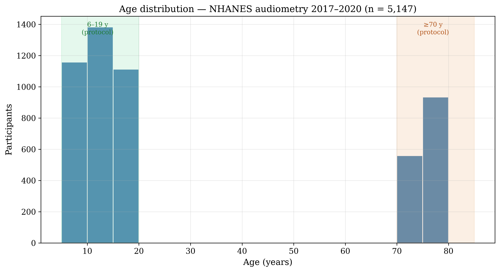
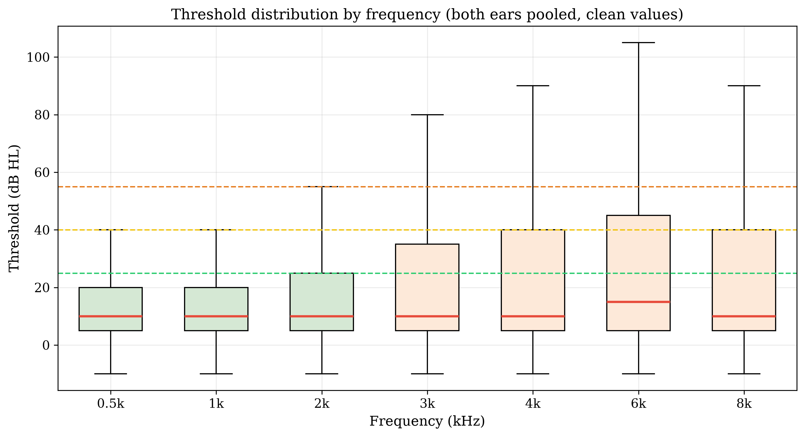
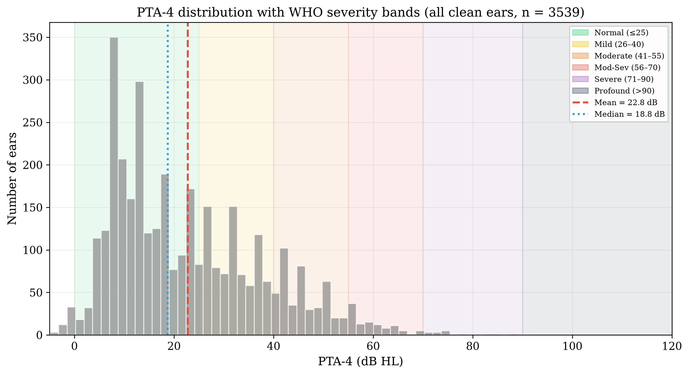
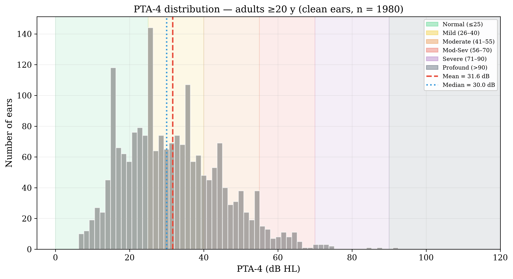
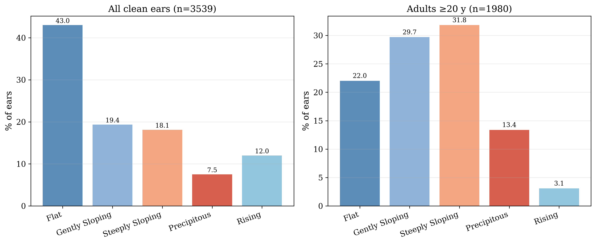
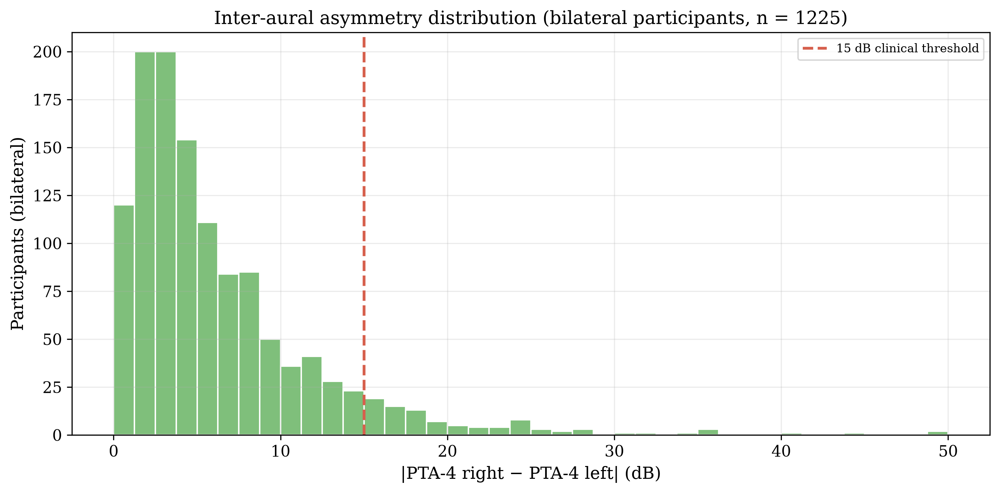
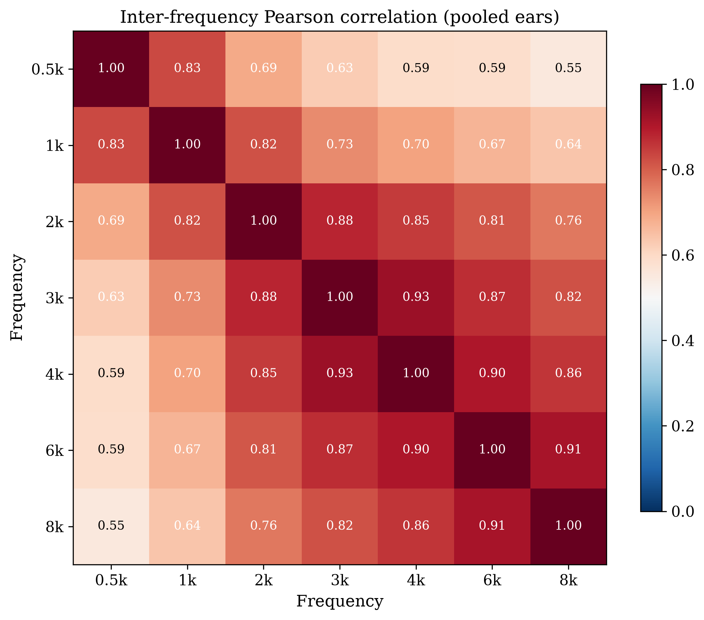
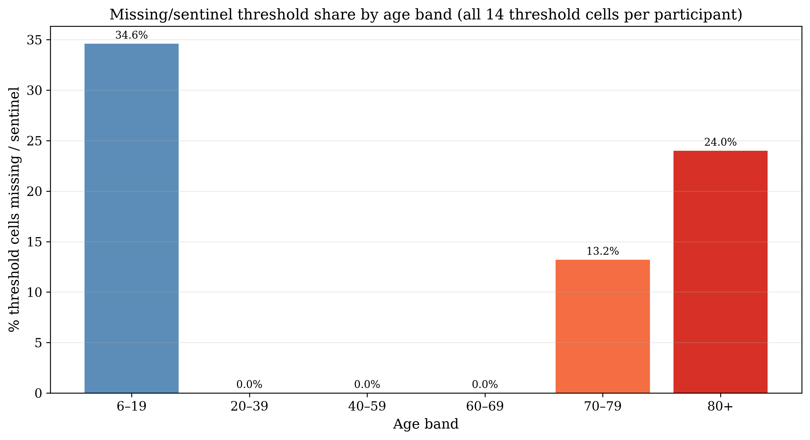

# Data Source and Files

- **Exam file:** `P_AUX.xpt` — NHANES 2017–2020 (pre-pandemic) audiometry examination + hearing questionnaire, **5,147 participants**.
- **Demographic file:** `P_DEMO.xpt` (2017–2020 pre-pandemic combined release) — linked by `SEQN`.
- **Frequencies tested:** 500, 1000, 2000, 3000, 4000, 6000, 8000 Hz, air-conduction, both ears (14 threshold variables).
- **Additional data in file:** tympanometry, otoscopy, acoustic-reflex, hearing-questionnaire items.

> **Protocol note (critical):** per NHANES protocol, audiometry in this cycle was administered to **children/adolescents aged 6–19 y** and **adults aged ≥70 y**. The file contains **no participants aged 20–69**.

# Data Dictionary (key variables)

| Variable | Meaning |
|----------|---------|
| `SEQN` | Participant identifier |
| `AUXU{500,1k,2k,3k,4k,6k,8k}{R,L}` | Air-conduction thresholds (dB HL) per ear |
| `AUXTMEP{R,L}`, `AUXTCOMR/L` | Tympanometric pressure / compliance |
| `AUATYMTR/L` | Tympanogram type |
| `AUXU1K2{R,L}` | 1 kHz retest (QC) |
| `AUQ010` | Hearing-aid use item (adult subgroup only) |
| `AUQ540`, `AUQ580` | 3+ months loud-noise exposure items (adult subgroup only) |
| `RIDAGEYR`, `RIAGENDR` (P_DEMO) | Age (years), sex |

# Cleaning Pipeline

NHANES sentinel codes are stored as numeric values and **must be converted to missing** before any statistic:

| Code | Meaning |
|------|---------|
| 666 | No response at maximum output |
| 777 | Refused |
| 888 | Could not obtain test result |
| 999 | Not tested |
| SAS subnormal (<1e−70) | Implied missing |

Valid thresholds were clipped to −10 to 120 dB HL. All statistics below use cleaned values.

# Sample Flow

| Stage | Participants | Ears |
|-------|-------------|------|
| Raw file | 5,147 | — |
| With audiometry exam record | 5,147 | — |
| Exam status "complete" | 3,775 | — |
| **Clean ears (all 7 freqs, no sentinels)** | **2,314** | **3,539** |
| — of which **adults ≥20 y** (i.e. ≥70 y per protocol) | 1,125 | 1,980 |

# Demographics

**Age (full file, n = 5,147 with audiometry):** mean 30.7 y, median 15.0 y, range 6.0–80.0 y.

**Age-band composition (protocol effect):**

| Age band | Participants | % |
|----------|-------------|---|
| 6–19 | 3,654.0 | 71.0 |
| 20–39 | nan | nan |
| 40–59 | nan | nan |
| 60–69 | nan | nan |
| 70–79 | 917.0 | 17.8 |
| 80+ | 576.0 | 11.2 |

**Sex:** full file 48.8% female; clean-ear set 49.9%; adult clean set 51.4%.

**Clean-ear set age:** mean 47.8 y (SD 31.6), median 70.0 — the complete-threshold subset skews older because older adults who completed all frequencies (and children) both contribute, while the 6–19 group remains the largest single band.

# Threshold Distributions

| Frequency | n (pooled) | Mean (dB) | SD | Median |
|-----------|-----------|-----------|-----|--------|
| 0.5k | 7,284 | 14.3 | 13.5 | 10.0 |
| 1k | 7,291 | 14.2 | 15.5 | 10.0 |
| 2k | 7,373 | 18.1 | 19.7 | 10.0 |
| 3k | 7,054 | 21.7 | 23.0 | 10.0 |
| 4k | 7,349 | 22.5 | 25.3 | 10.0 |
| 6k | 7,245 | 25.2 | 25.9 | 15.0 |
| 8k | 7,140 | 23.3 | 27.3 | 10.0 |

Thresholds increase monotonically with frequency — the classic high-frequency loss pattern.

# PTA-4 and WHO Severity

PTA-4 = mean of 500, 1000, 2000, 4000 Hz.

| Severity (WHO) | All clean ears | Adults ≥20 y |
|----------------|---------------|----------------|
| Normal | 62.8% | 37.5% |
| Mild | 22.9% | 38.3% |
| Moderate | 11.4% | 19.5% |
| Moderately Severe | 2.4% | 4.2% |
| Severe | 0.4% | 0.5% |
| Profound | 0.0% | 0.1% |

# The Borderline Problem

Share of ears within ±5 dB of a WHO severity boundary:

| Boundary zone | dB range | All clean ears | Adults ≥20 y |
|---------------|----------|---------------|----------------|
| Normal–Mild | 20–30 dB | 20.6% | 32.0% |
| Mild–Moderate | 35–45 dB | 13.1% | 22.2% |
| Moderate–Mod-Sev | 50–60 dB | 4.7% | 8.2% |
| Mod-Sev–Severe | 65–75 dB | 0.7% | 1.1% |
| Severe–Profound | 85–95 dB | 0.1% | 0.2% |

**39.2%** of all clean ears and **63.6%** of adult ears fall within ±5 dB of a boundary — the population where crisp classification is least reliable.

# Audiogram Configuration

Slope = threshold(4 kHz) − threshold(500 Hz).

| Configuration | All clean ears | Adults ≥20 y |
|---------------|---------------|----------------|
| Flat | 43.0% | 22.0% |
| Gently Sloping | 19.4% | 29.7% |
| Steeply Sloping | 18.1% | 31.8% |
| Precipitous | 7.5% | 13.4% |
| Rising | 12.0% | 3.1% |

# Inter-Aural Asymmetry

Bilateral participants only (n = 1,225); |PTA-4 R − PTA-4 L|:

- Symmetric (≤15 dB): 94.0%
- Mildly asymmetric (16–30 dB): 5.3%
- Moderately asymmetric (31–45 dB): 0.6%
- Severely asymmetric (>45 dB): 0.2%

Mean asymmetry 5.6 dB, median 3.8 dB.

# Inter-Frequency Correlations

Adjacent-frequency correlations are high (mean r = 0.88); the 500 Hz–8 kHz correlation is moderate (r = 0.55) — frequency-specific information is partly independent of the PTA average.

# Missing Data Patterns

Older participants have far higher missing/sentinel rates at high frequencies — the reason the clean-ear set (all 7 frequencies required) skews younger per participant even though adult ears dominate the ear count.

# Adult-Only (≥20 y) Subset — Decision Notes

- Because the protocol tested only 6–19 and ≥70, **"adults ≥20" is exactly the ≥70 subgroup**: 1,125 participants, 1,980 clean ears.
- Adult clean-ear age: mean 75.7 (SD 3.8), median 76.0.
- Adult severity: Normal 37.5%; Mild 38.3%; Moderate 19.5%; Moderately Severe 4.2%; Severe 0.5%; Profound 0.1%.
- Borderline share: 63.6%; configuration: Flat 22.0%, Gently Sloping 29.7%, Steeply Sloping 31.8%, Precipitous 13.4%, Rising 3.1%.
- The FIS membership functions were optimised on the full training set (all ages); an adults-only analysis re-runs validation on this subset with the deployed parameters, or can re-optimise parameters on adult training data (larger change).

# Key Takeaways

1. **The cohort is bimodal by design** (6–19 and ≥70); any "general adult population" framing is incorrect for this cycle.
2. ~**39.2%** of ears sit within ±5 dB of a severity boundary — the core motivation for graded fuzzy classification.
3. High-frequency thresholds are frequently missing in older adults; clean-ear selection (all 7 frequencies) is not age-neutral.
4. Configurations are predominantly flat/gently sloping in the full set; the adult subset shifts toward steeper slopes.
5. Inter-frequency correlations justify frequency-resolved (fuzzy) rather than PTA-only representation.
