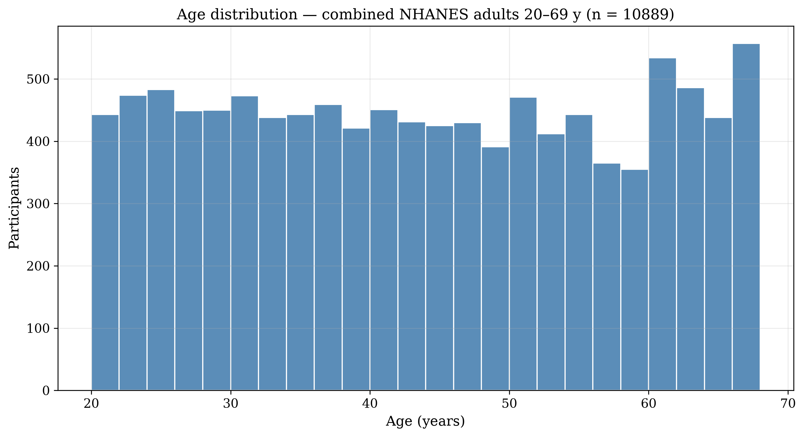
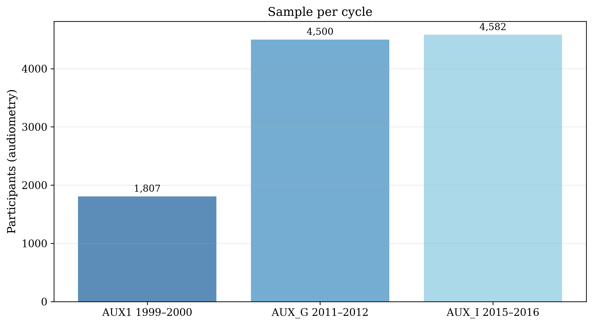
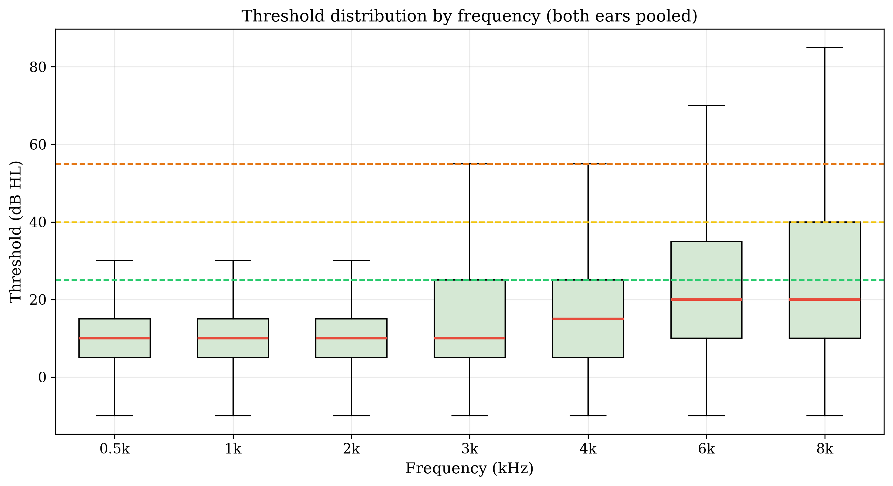
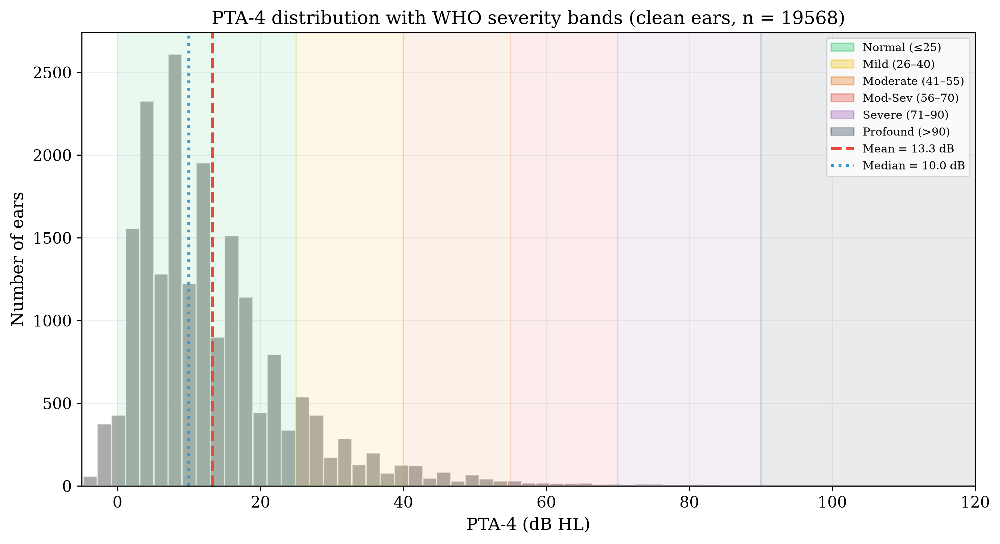
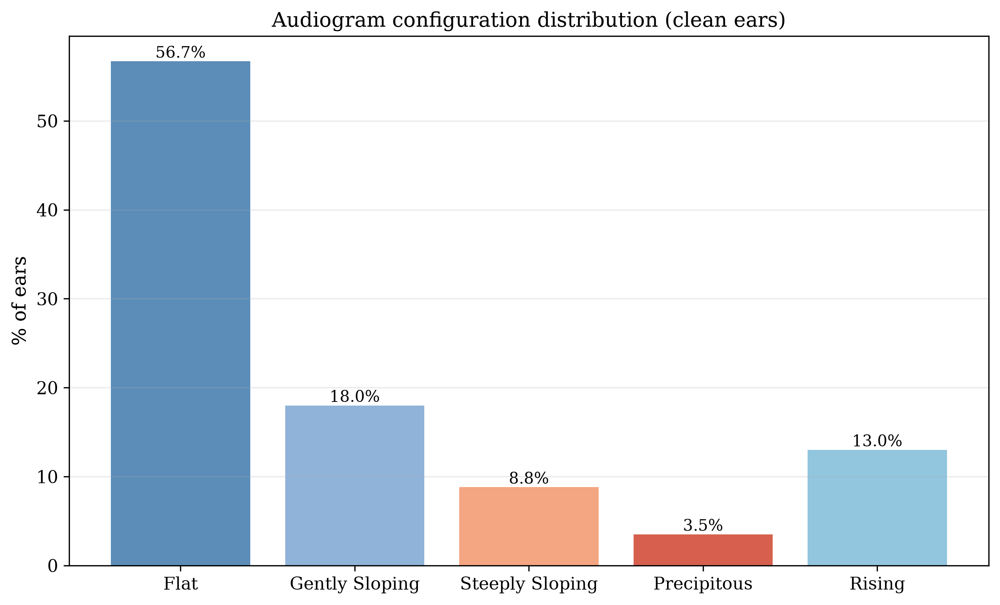
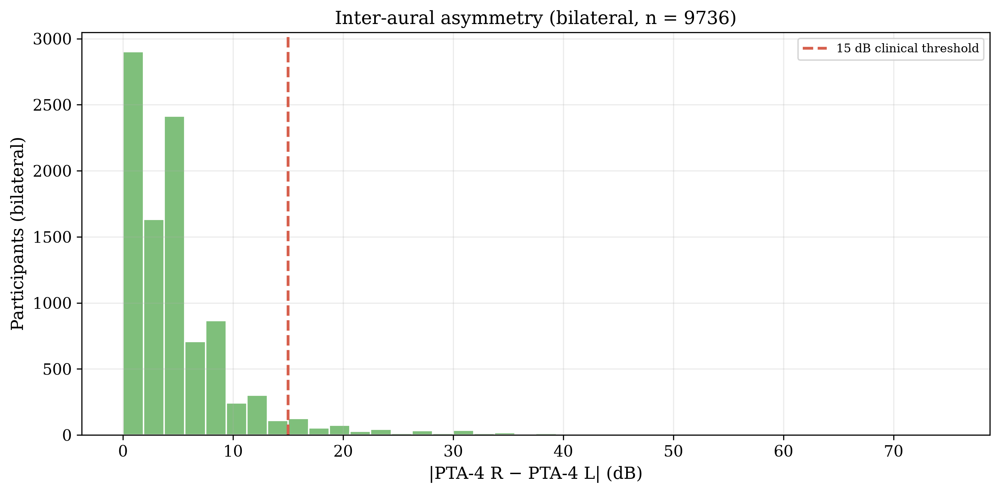
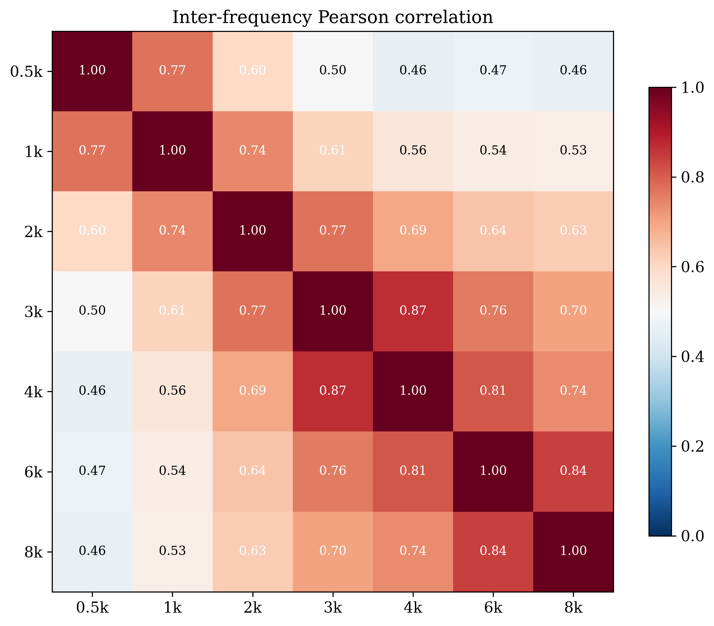
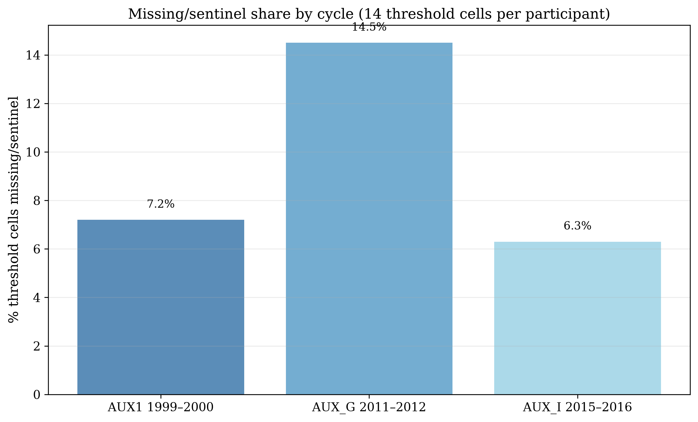

# Data Source and Files

| Cycle | Exam file | Participants | Ages |
|-------|-----------|--------------|------|
| AUX1 1999–2000 | /opt/data/AUX1_9900.xpt | 1,807 | 20–69 |
| AUX_G 2011–2012 | /opt/data/AUX_G_1112.xpt | 4,500 | 20–69 |
| AUX_I 2015–2016 | /opt/data/AUX_I_1516.xpt | 4,582 | 20–69 |

- **Protocol:** these cycles administered audiometry to adults aged 20–69 y (unlike the 2017–2020 P_AUX cycle, which tested only 6–19 and ≥70).
- **Frequencies:** 500, 1000, 2000, 3000, 4000, 6000, 8000 Hz, air-conduction, both ears.
- **Demographics:** linked via `SEQN` to each cycle's DEMO file (age, sex).

# Cleaning

Sentinel codes converted to missing before any statistic: **666** (no response), **777** (refused), **888** (could not obtain), **999** (not tested). Values clipped to −10–120 dB HL. (The 1999–2000 cycle uses 666 only; 2011–2016 use 666 and 888.)

# Sample Flow

| Stage | Participants | Ears |
|-------|-------------|------|
| Combined audiometry participants | 10,889 | — |
| Clean ears (all 7 freqs, no sentinels) | 9,832 | 19,568 |

Ears per cycle: AUX_I 2015–2016 8,566, AUX_G 2011–2012 7,670, AUX1 1999–2000 3,332

# Demographics

**Age (full combined file):** mean 43.9 y, median 44.0 y, range 20–69 y; 51.8% female.

**Clean-ear set:** 9,832 participants, 19,568 ears, mean age 43.9 y, 50.9% female.

# Threshold Distributions

| Frequency | n (pooled) | Mean (dB) | SD | Median |
|-----------|-----------|-----------|-----|--------|
| 0.5k | 19,655 | 11.2 | 10.8 | 10.0 |
| 1k | 19,651 | 11.3 | 11.5 | 10.0 |
| 2k | 19,651 | 11.9 | 13.8 | 10.0 |
| 3k | 19,643 | 16.3 | 17.2 | 10.0 |
| 4k | 19,634 | 19.5 | 19.3 | 15.0 |
| 6k | 19,622 | 25.5 | 20.1 | 20.0 |
| 8k | 19,589 | 27.4 | 22.4 | 20.0 |

# PTA-4 and WHO Severity

PTA-4 = mean of 500, 1000, 2000, 4000 Hz.

| Severity (WHO) | % of clean ears |
|----------------|----------------|
| Normal | 88.1% |
| Mild | 8.7% |
| Moderate | 2.2% |
| Moderately Severe | 0.6% |
| Severe | 0.3% |
| Profound | 0.1% |

# The Borderline Problem

Share of clean ears within ±5 dB of a WHO severity boundary:

| Boundary zone | dB range | % of ears |
|---------------|----------|-----------|
| Normal–Mild | 20–30 dB | 13.9% |
| Mild–Moderate | 35–45 dB | 3.1% |
| Moderate–Mod-Sev | 50–60 dB | 0.9% |
| Mod-Sev–Severe | 65–75 dB | 0.3% |
| Severe–Profound | 85–95 dB | 0.0% |

**18.2%** of clean ears fall within ±5 dB of a boundary.

# Audiogram Configuration

Slope = threshold(4 kHz) − threshold(500 Hz).

| Configuration | % of clean ears |
|---------------|----------------|
| Flat | 56.7% |
| Gently Sloping | 18.0% |
| Steeply Sloping | 8.8% |
| Precipitous | 3.5% |
| Rising | 13.0% |

# Inter-Aural Asymmetry

Bilateral participants (n = 9,736); |PTA-4 R − PTA-4 L|:

- 94.9% symmetric (≤15 dB)
- 3.5% mildly asymmetric (16–30 dB)
- 0.9% moderately asymmetric (31–45 dB)
- 0.6% severely asymmetric (>45 dB)

Mean asymmetry 5.2 dB, median 3.8 dB.

# Inter-Frequency Correlations

Adjacent-frequency mean r = 0.80; 500 Hz–8 kHz r = 0.46.

# Missing Data Patterns

# Key Takeaways

1. **True working-age adult cohort:** 10,889 participants aged 20–69 across three cycles — the population the 2017–2020 P_AUX cycle does not contain.
2. Hearing thresholds increase monotonically with frequency; absolute levels are lower than the ≥70 cohort (age-related loss less severe).
3. **18.2%** of ears sit within ±5 dB of a severity boundary — still a substantial borderline population.
4. Configurations are predominantly flat/gently sloping; steeply sloping and precipitous patterns are less common than in the ≥70 cohort.
5. Inter-frequency correlations justify frequency-resolved (fuzzy) representation.
