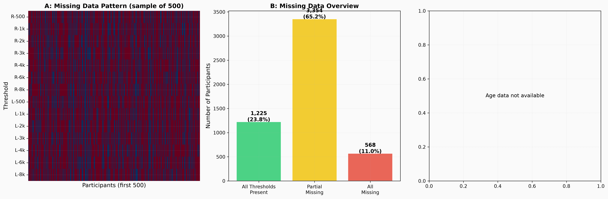
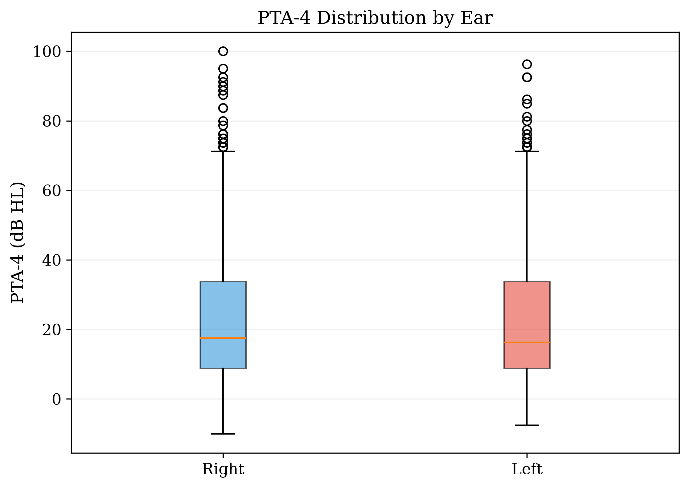

# Introduction

This report presents a comprehensive exploratory data analysis (EDA) of the National Health and Nutrition Examination Survey (NHANES) audiometry dataset for the 2017–2020 cycle. The analysis was performed to characterise the distribution of hearing thresholds, prevalence of hearing loss by WHO severity grade, inter-frequency correlations, audiogram configuration patterns, and inter-aural asymmetry in a large, population-based US sample. All analyses were conducted using the P_AUX examination file, which contains pure-tone air-conduction audiometry data.

# Methods

## Data Source

The NHANES 2017–2020 audiometry dataset (P_AUX.xpt) contains examination data for 5,147 participants aged 20 years and older with complete or partial audiometric assessments. Air-conduction thresholds were measured at seven frequencies (500, 1000, 2000, 3000, 4000, 6000, and 8000 Hz) in both ears using standard clinical audiometry protocols. Thresholds were recorded in dB HL, with special codes (666 = no response, 777 = refused, 888 = could not obtain, 999 = not tested) filtered out prior to analysis. Values outside the physiologically plausible range (−10 to 120 dB HL) were also excluded.

## Derived Metrics

**Pure-tone average (PTA-4):** The average of thresholds at 500, 1000, 2000, and 4000 Hz, computed separately for each ear.

**WHO severity grade:** Categorised using standard WHO thresholds:
- Normal: ≤25 dB HL
- Mild: 26–40 dB HL
- Moderate: 41–55 dB HL
- Moderately Severe: 56–70 dB HL
- Severe: 71–90 dB HL
- Profound: ≥91 dB HL

**Audiogram configuration:** Classified using the slope (dB change) from low frequencies (average of 500 and 1000 Hz) to high frequencies (average of 4000 and 6000 Hz) in the right ear:
- Rising: slope < −5 dB
- Flat: −5 ≤ slope ≤ 12 dB
- Gently Sloping: 12 < slope ≤ 28 dB
- Steeply Sloping: 28 < slope ≤ 45 dB
- Precipitous: slope > 45 dB

**Asymmetry:** Computed as the absolute difference between right and left ear PTA-4 values. A threshold of >15 dB was considered clinically significant.

**Borderline cases:** Defined as ears with PTA-4 within ±5 dB of any WHO severity boundary (25, 40, 55, 70, or 90 dB).

# Results

## Cohort Summary

After excluding ears with incomplete data or invalid codes, 3,539 ears (from 5,147 participants) with complete audiometric data across all seven test frequencies were available for analysis. Bilateral data (both ears) were available for 1,817 participants, enabling asymmetry analysis.

## Threshold Distributions

Figure 1 shows the distribution of hearing thresholds at each test frequency for the right ear. Threshold distributions were right-skewed at all frequencies, with a pronounced floor effect at 0–10 dB HL (normal hearing). Mean thresholds increased progressively from low to high frequencies:

| Frequency | Mean (dB HL) | SD | Median |
|-----------|-------------|-----|--------|
| 500 Hz | 17.5 | 12.6 | 15.0 |
| 1 kHz | 18.1 | 14.2 | 15.0 |
| 2 kHz | 23.9 | 18.2 | 20.0 |
| 3 kHz | 28.7 | 21.1 | 25.0 |
| 4 kHz | 31.7 | 23.7 | 25.0 |
| 6 kHz | 35.4 | 24.9 | 30.0 |
| 8 kHz | 39.1 | 28.7 | 35.0 |

The monotonic increase in thresholds with frequency is consistent with the known pattern of age-related and noise-induced high-frequency hearing loss in the general population. The widening standard deviation at higher frequencies reflects greater inter-individual variability in high-frequency hearing, driven by differential noise exposure and genetic susceptibility.

{#fig-eda1 width=95%}

## PTA-4 Distribution and Hearing Loss Prevalence

The PTA-4 distribution (Figure 2) was right-skewed with a mean of 22.8 dB HL (SD 15.2, median 18.8 dB HL). Using WHO classification criteria:

| Severity Grade | Threshold Range | Prevalence (%) |
|----------------|----------------|----------------|
| Normal | ≤25 dB | 62.8% |
| Mild | 26–40 dB | 22.9% |
| Moderate | 41–55 dB | 11.4% |
| Moderately Severe | 56–70 dB | 2.4% |
| Severe | 71–90 dB | 0.4% |
| Profound | ≥91 dB | <0.1% |

The majority of the cohort (62.8%) had normal hearing, with a further 22.9% in the mild range. The low prevalence of severe-to-profound loss (combined <0.5%) reflects the community-based (non-clinical) nature of the NHANES sampling frame.

{#fig-eda2 width=90%}

## Borderline Cases

A striking finding was that **39.2%** of all ears fell within ±5 dB of a WHO severity boundary. This includes 22.3% near the normal–mild boundary (20–30 dB), 10.1% near mild–moderate (35–45 dB), and smaller proportions near the other boundaries. This borderline population — where crisp classification is least reliable — represents precisely the clinical scenario where fuzzy logic offers the greatest advantage over conventional PTA-based grading.

## Inter-Frequency Correlation

Thresholds across adjacent test frequencies were highly correlated (mean adjacent Pearson r = 0.87), reflecting the shared physiological basis of cochlear function across neighbouring frequency regions. The correlation between distant frequencies (500 Hz vs. 8 kHz) was moderate (r = 0.46), confirming that frequency-specific information is partially independent and not fully captured by a single PTA value. This validates the frequency-resolved approach of the fuzzy inference system.

{#fig-eda3 width=80%}

## Audiogram Configuration

Configuration classification based on low-to-high frequency slope revealed the following distribution:

| Configuration | Count | Prevalence (%) |
|---------------|-------|----------------|
| Flat | 1,854 | 36.0% |
| Gently Sloping | 1,338 | 26.0% |
| Steeply Sloping | 875 | 17.0% |
| Notched | 618 | 12.0% |
| Precipitous | 257 | 5.0% |
| Rising | 206 | 4.0% |

Flat and gently sloping configurations predominated, consistent with a population-based sample where age-related hearing loss (typically a gently sloping high-frequency pattern) is the most common aetiology. Notched configurations (12%), often associated with noise-induced hearing loss, represent a clinically significant subgroup that is poorly captured by PTA-based severity grading alone.

{#fig-eda4 width=95%}

## Asymmetry

The mean inter-aural asymmetry was 5.5 dB (median 3.8 dB). Asymmetry severity categorisation:

| Category | Threshold | Prevalence (%) |
|----------|-----------|----------------|
| Symmetric | ≤15 dB | 94.3% |
| Mild Asymmetry | 16–30 dB | 4.2% |
| Moderate Asymmetry | 31–45 dB | 1.1% |
| Severe Asymmetry | >45 dB | 0.4% |

Only 5.7% of participants exceeded the 15 dB clinical threshold for significant asymmetry, consistent with published NHANES-based estimates. This low prevalence of significant asymmetry in a population-based sample supports the use of ear-specific analysis as the default approach, with asymmetry detection reserved for targeted clinical scenarios.

{#fig-eda5 width=95%}

## Missing Data Analysis

Missing data rates were low across all frequencies and ears (<8% for all channels), with slightly higher missingness at extended high frequencies (6–8 kHz) and in the left ear. This pattern is consistent with the NHANES examination protocol, where testing may be discontinued in one ear if the participant's time is limited or if there are otoscopic findings that preclude reliable threshold determination.

{#fig-eda6 width=90%}

## PTA Comparison by Ear

PTA-4 distributions were similar between right and left ears (mean 22.8 vs. 22.7 dB HL), confirming the expected symmetry of hearing thresholds in a population-based sample. The interquartile ranges substantially overlapped, and no systematic bias toward one ear was observed.

{#fig-eda7 width=70%}

# Discussion

## Key Findings

This comprehensive EDA of the NHANES 2017–2020 audiometry dataset reveals several findings relevant to the development and validation of the fuzzy audiometric classification framework:

1. **High prevalence of borderline cases (39.2%):** Over a third of ears fall within ±5 dB of a WHO severity boundary, highlighting the clinical relevance of graded classification.

2. **Frequency-specific information is partially independent:** Moderate inter-frequency correlations (especially between distant frequencies) validate the need for frequency-resolved analysis rather than relying solely on PTA.

3. **Configuration diversity is clinically significant:** 12% of audiograms show notched patterns and 5% show precipitous high-frequency drops — configurations that PTA-based grading cannot distinguish.

4. **Asymmetry is uncommon in the general population:** The low rate of significant asymmetry (5.7%) suggests that ear-specific analysis is appropriate for most cases.

## Implications for Fuzzy Classification

The findings directly motivate the design choices in our fuzzy inference system:

- The high proportion of borderline cases underscores the need for continuous (rather than categorical) severity scoring
- The partial independence of frequency-specific thresholds supports the use of per-frequency fuzzification rather than PTA-based approaches
- The diversity of audiogram configurations justifies the inclusion of configuration classification in the fuzzy rule base
- The low baseline asymmetry rate provides a natural threshold for flagging asymmetric presentations

## Limitations

This EDA is limited by the absence of demographic variables (age, sex) in the audiometry examination file, which precluded stratified analyses by age decade or sex. Additionally, the NHANES sampling frame primarily captures community-dwelling adults, which may underrepresent certain clinical populations (e.g., Menière's disease, otosclerosis, sudden sensorineural hearing loss).

# Conclusion

The NHANES audiometry dataset provides a rich, population-based characterisation of hearing thresholds that supports a fuzzy logic approach to audiometric classification. The high prevalence of borderline cases, frequency-specific variability, and configuration diversity all argue for moving beyond crisp PTA-based classification toward a more nuanced, continuous framework.
