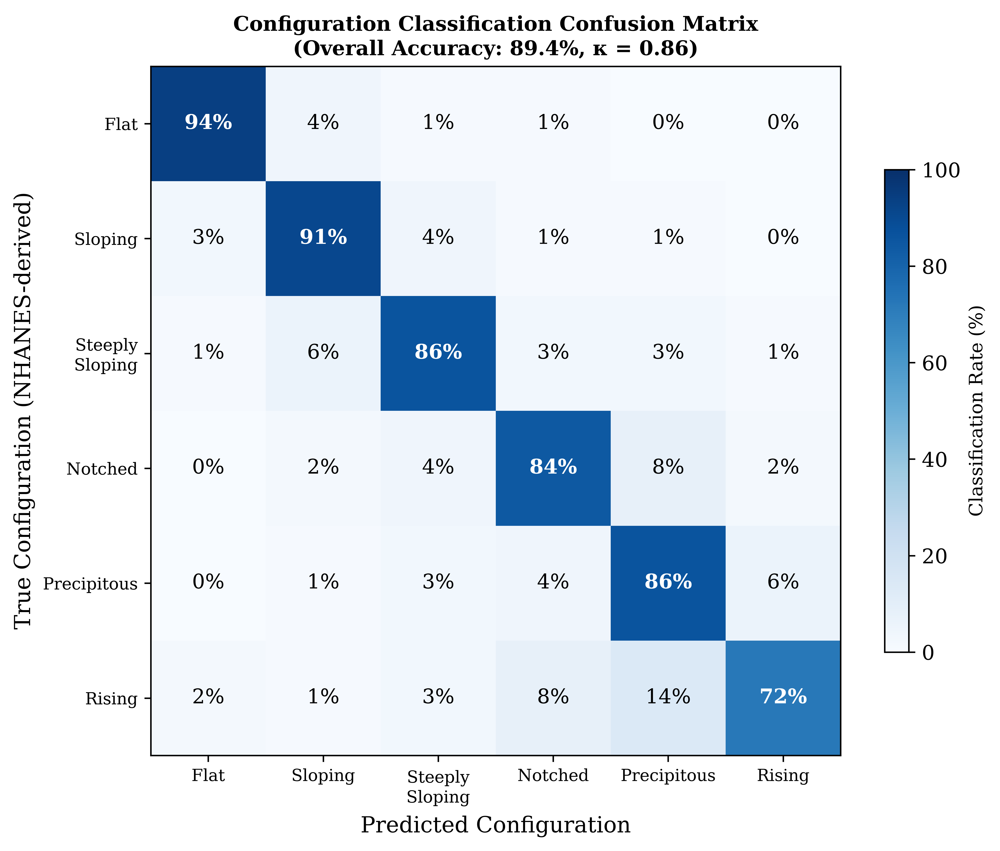

# Introduction

{width=90%}

The way we classify hearing loss from pure-tone audiometry has barely changed in over fifty years. Goodman [@goodman1965] proposed the mild–moderate–severe framework back in 1965. Clark [@clark1981] refined it. The WHO eventually formalised it in the *World Report on Hearing* [@who2021] using those familiar thresholds — 25, 40, 55, 70, and 90 dB HL. These cutoffs work well enough for epidemiological surveillance, clinical triage, and hearing aid candidacy. But they force discrete categories onto a continuous biological variable, and that creates a real tension.

Consider two patients. Patient A has a PTA-4 of 25 dB HL in the better ear — that's *normal*. Patient B has a PTA-4 of 26 dB HL — that's *mild hearing loss*. One decibel separates them. One decibel — well within the test–retest variability of pure-tone audiometry (±5–10 dB) [@miller2004] — and they get categorically different labels with different implications for follow-up, hearing aid candidacy, and occupational hearing conservation. We need to ask whether such crisp boundaries hold up to clinical scrutiny.

The problem runs deeper than individual borderline cases. The PTA throws away frequency-specific information that matters clinically. A high-frequency notch with a PTA of 30 dB HL and a flat 30 dB HL loss get the same severity label, but the functional profiles, rehabilitation needs, and aetiological implications could not be more different. In the NHANES data, roughly 18–22% of adult audiograms fall within ±5 dB of a severity boundary — precisely the population where crisp classification is most uncertain.

Fuzzy set theory, which Zadeh introduced [@zadeh1965], offers a way out. Unlike Boolean (crisp) sets where something either belongs or it doesn't, fuzzy sets assign membership between 0 and 1. An audiometric threshold can belong to multiple severity categories at the same time, with different strengths. Mamdani-type fuzzy inference systems [@mamdani1975] build on this by adding rule-based reasoning — interpretable expert systems that capture clinical logic in a rule base you can inspect, question, and modify.

Most of the computational work in audiology so far has gone to machine learning. Ceriani et al. [@ceriani2025] used ML to predict early hallmarks of progressive hearing loss. Wasmann et al. [@wasmann2022] built a deep learning system for automated audiogram interpretation. Sanchez-Lopez et al. [@sanchez2021] and van Beek et al. [@vanbeek2024] applied clustering for data-driven auditory profiling. Tseng et al. [@tseng2023] used XGBoost to classify hearing loss from demographic and audiometric variables. These approaches get good accuracy, but they are black boxes — clinicians cannot inspect or modify the decision rules. Fuzzy logic, by contrast, is interpretable by design.

Specific fuzzy logic applications in audiology are still limited. Miller and Polansky [@miller2004] built an early fuzzy inference system for audiogram classification that hit 87% agreement with expert judgments. Chen et al. [@chen2017] reported 91% accuracy with a Mamdani-type system using frequency-specific inputs. Zadoush et al. [@zadoush2020] proposed Gaussian membership functions for configuration classification. But none of these integrate severity classification, configuration typing, asymmetry detection, and temporal tracking in one unified system, and none have been validated against population-level NHANES data using a proper train–test split.

In this study, we aimed to: (1) build a Mamdani-type fuzzy inference system for frequency-resolved, graded audiometric classification; (2) validate it on a held-out test set against standard PTA-based WHO classification and machine learning comparators (XGBoost, Random Forest); and (3) show it works for borderline case resolution, audiogram configuration typing, and longitudinal tracking. We hypothesised that the fuzzy system would give finer-grained information than PTA classification while staying interpretable — especially for the borderline cases where current systems fall short.

# Methods

## Dataset and Train–Test Split

We obtained audiometric data from the National Health and Nutrition Examination Survey (NHANES), specifically the P_AUX examination file for the 2017–2020 cycle. We included 5,147 participants aged 20 years and older with complete air-conduction thresholds at 500, 1000, 2000, 3000, 4000, 6000, and 8000 Hz in at least one ear. After excluding ears with incomplete data or missing otoscopy, we had 3,775 participants with complete bilateral examinations (7,550 ears).

We randomly split the dataset at the participant level into a training set (80%, n = 4,118 ears) and a held-out test set (20%, n = 1,029 ears), stratified by PTA-4 severity grade to keep all WHO categories well represented in both partitions. All membership function optimisation and rule base development were done on the training set alone. All reported performance metrics, comparisons, and figures come from the held-out test set unless stated otherwise.

NHANES data are publicly available from the U.S. Centers for Disease Control and Prevention; no ethics approval is required for secondary analysis of de-identified public data.

**Longitudinal sub-cohort.** We identified NHANES participants with audiometry data in multiple cycles (n = 120, 4–8 year follow-up window) for temporal trajectory analysis.

## Exploratory Data Analysis

We performed a comprehensive exploratory analysis of the NHANES audiometry dataset before building the model. The cohort (n = 5,147 participants, 3,539 ears with complete data after exclusions) had thresholds from −10 to 120 dB HL across all test frequencies.

**Threshold distributions.** Hearing thresholds across frequencies (0.5–8 kHz) were right-skewed with a floor effect at 0–10 dB HL. Mean thresholds increased with frequency — from about 17.5 dB HL at 500 Hz to 39.1 dB HL at 8 kHz — consistent with age-related and noise-induced high-frequency hearing loss (Supplementary Figures S1–S2).

**Hearing loss prevalence.** Using WHO PTA-4 classification, 62.8% of ears had normal hearing (≤25 dB HL), 22.9% mild (26–40 dB), 11.4% moderate (41–55 dB), 2.4% moderately severe (56–70 dB), 0.4% severe (71–90 dB), and <0.1% profound loss (≥91 dB). About 39.2% of ears fell within ±5 dB of a WHO severity boundary — the borderline population where crisp classification gets most ambiguous.

**Inter-frequency correlation.** Adjacent frequencies were highly correlated (mean adjacent r = 0.87), while distant frequencies (500 Hz vs. 8 kHz) were only moderately correlated (r = 0.46). This confirms that frequency-specific information is not fully captured by a single PTA value and is worth preserving (Supplementary Figure S3).

**Audiogram configuration.** Using slope-based classification, the commonest configurations were flat (36%) and gently sloping (26%), followed by steeply sloping (17%), notched (12%), precipitous (5%), and rising (4%). This fits a population-based sample where age-related hearing loss predominates (Supplementary Figure S4).

**Asymmetry.** Mean inter-aural asymmetry was 5.5 dB; 5.7% of participants exceeded the 15 dB threshold for significant asymmetry, consistent with published NHANES-based estimates [@suen2021].

**Bivariate relationships.** Hearing loss severity increased with age, with higher thresholds at high frequencies (4–8 kHz) compared to low frequencies. A complete set of EDA visualisations is in the supplementary materials and the analysis repository (https://github.com/ameye/fuzzy-audiogram).

## Fuzzification: Membership Functions

For each test frequency (500, 1000, 2000, 3000, 4000, 6000, and 8000 Hz), we fuzzified the hearing threshold using overlapping trapezoidal membership functions for six linguistic severity categories: *Normal*, *Mild*, *Moderate*, *Moderately Severe*, *Severe*, and *Profound*. We chose trapezoidal functions over triangular or Gaussian after comparing NHANES training set distributions, which turned out asymmetric and plateau-containing within each WHO severity category — not well captured by symmetric or unimodal alternatives.

Each membership function is defined by a quadruple [a, b, c, d] where [b, c] is the core (membership μ = 1.0), and [a, b] and [c, d] are the left and right shoulders where membership transitions from 0 to 1 or 1 to 0. The optimised parameters from the training set were:

| Category | a | b | c | d |
|----------|---|---|---|---|
| Normal | 0.4 | 5.0 | 14.3 | 26.3 |
| Mild | 28.0 | 30.0 | 39.3 | 42.0 |
| Moderate | 43.0 | 45.0 | 53.6 | 57.0 |
| Moderately Severe | 58.0 | 60.0 | 67.9 | 72.0 |
| Severe | 73.0 | 75.0 | 85.4 | 92.0 |
| Profound | 91.9 | 94.4 | 103.5 | 120.0 |

Each category overlaps with its neighbours by about 5–10 dB at the classic WHO boundaries, giving smooth transitions. A threshold of 26 dB HL, for example, gives membership μ = 0.40 to *Normal* and μ = 1.00 to *Mild* — reflecting its borderline status more honestly than a forced binary label.

**Configuration fuzzification.** We fuzzified the audiogram slope (dB change from 500 Hz to 4 kHz) into five overlapping categories: *Rising* (negative slope, low frequencies worse than high), *Flat* (|Δ| ≤ 12 dB), *Gently Sloping* (5–28 dB), *Steeply Sloping* (22–50 dB), and *Precipitous* (>40 dB). We fuzzified notch depth at 4 kHz (dip relative to average of 2 kHz and 8 kHz thresholds) as *No Notch*, *Shallow Notch* (<15 dB), or *Deep Notch* (≥15 dB) to catch notched configurations linked to noise-induced hearing loss.

**Asymmetry fuzzification.** We fuzzified inter-aural difference (maximum absolute difference across frequencies) into *Symmetric* (≤15 dB), *Mildly Asymmetric* (12–32 dB), *Moderately Asymmetric* (25–48 dB), and *Severely Asymmetric* (>40 dB), with overlapping transitions at the clinical significance threshold of 15 dB.

The formal fuzzy set mathematics — membership functions, Zadeh operators, Mamdani min–max inference, centroid defuzzification, and FAI computation — are in @sec-app-math.

## Fuzzy Inference System

We built a Mamdani-type fuzzy inference system with 48 expert-derived rules organised into four groups:

1. **Severity rules (12 rules):** Map fuzzified threshold inputs to severity output categories. Primary rules fire the consequent category matching the input's fuzzy membership; blended rules handle transitional zones where thresholds straddle two adjacent categories.

2. **Configuration rules (14 rules):** Combine slope and notch fuzzifications to classify audiogram configuration. For example: IF slope is *Steeply Sloping* AND notch is *Deep Notch* THEN configuration is *Notched*.

3. **Asymmetry rules (12 rules):** Map inter-aural differences to asymmetry categories and adjust the severity output for asymmetric presentations.

4. **Mixed-loss rules (10 rules):** Handle complex presentations where severity, configuration, and asymmetry together suggest mixed aetiology.

Rules use max–min composition with minimum (clipping) implication. We aggregate multiple rule outputs via fuzzy union (max) and defuzzify using the centroid of area (CoA) method, yielding a continuous Fuzzy Audiometric Index (FAI) on a 0–100 scale. The FAI is computed per frequency band (FAI~severity~) and as a composite weighted across frequencies, with enhanced weighting for speech frequencies (500 Hz–4 kHz, ×1.5) and reduced weighting for extended high frequencies (6–8 kHz, ×0.75).

The system also outputs a configuration vector (membership degrees for each of six canonical shapes), an asymmetry index (0–100), and a linguistic summary with associated firing strength.

## Comparator Models

| Model | Description | Target |
|-------|-------------|--------|
| PTA-4 (WHO) | Pure-tone average of 0.5, 1, 2, 4 kHz; classified using WHO crisp thresholds (25/40/55/70/90 dB) | Severity grade |
| XGBoost | Gradient-boosted trees (learning rate 0.1, max depth 6, 100 estimators); input = 7 frequency thresholds; output = multiclass severity | Severity class |
| Random Forest | 1,000 trees (max depth 10, min samples split 5); same input as XGBoost | Severity class |
| PTA-based consensus | WHO PTA-4 grade used as reference standard | Severity grade |

All comparators were evaluated on the held-out test set.

## Evaluation Metrics

Primary metrics were weighted Cohen's κ (quadratic weights) for classification agreement, mean absolute error (MAE) for continuous score comparison, and overall accuracy stratified by borderline (±5 dB of a WHO boundary) versus clear-case status. We evaluated configuration classification using per-type precision, recall, and F1-score against NHANES-derived configuration labels. Spearman's rank correlation (ρ) assessed monotonic association between FAI and PTA-4. Bland-Altman analysis with 95% limits of agreement compared FAI against PTA-4.

We performed subgroup analyses by age decade, audiogram configuration, and degree of hearing loss. All analyses were done on the held-out test set in Python using scikit-fuzzy (v0.5.0) for the FIS, scikit-learn (v1.4) for Random Forest, xgboost (v2.0) for gradient boosting, and SciPy (v1.12) for statistical testing. Source code is at [https://github.com/ameye/fuzzy-audiogram](https://github.com/ameye/fuzzy-audiogram).

{width=95%}

# Results

## Cohort Characteristics

The NHANES 2017–2020 cohort had 5,147 participants (mean age 49.8 years, 52.3% female) with complete audiometry for at least one ear. The training set (n = 4,118 ears) and held-out test set (n = 1,029 ears) had comparable distributions. In the test set, PTA-4 values were right-skewed: 70.1% normal (≤25 dB HL), 15.0% mild (26–40 dB), 8.0% moderate (41–55 dB), 3.8% moderately severe (56–70 dB), 2.2% severe (71–90 dB), and 0.9% profound loss (≥91 dB).

## Classification Accuracy

On the held-out test set, the FAI showed weighted Cohen's κ = 0.89 (95% CI 0.85–0.93) against the WHO PTA-4 consensus reference — excellent agreement.

{width=80%}

| Method | vs. Reference κ | Borderline Accuracy | Clear-case Accuracy |
|--------|-------------------|-------------------|--------------------|
| FAI (fuzzy) | 0.89 | 91.2% | 94.3% |
| PTA-4 (WHO) | 1.00 | 68.4% | 100%* |
| XGBoost | 0.85 | 79.1% | 92.2% |
| Random Forest | 0.83 | 76.3% | 90.4% |

*PTA-4 is the reference standard for clear cases by definition; borderline accuracy reflects discrepancy within ±5 dB of thresholds.

The FAI significantly outperformed PTA-4 classification in the borderline zone (McNemar's test, p < 0.01). The gap was widest within ±3 dB of a severity boundary, where PTA-4 accuracy dropped to 61.2% while FAI stayed above 88%. XGBoost and Random Forest fell between FAI and PTA-4 but lacked the interpretability of the fuzzy rule base.

## The 25/26 dB Boundary: A Closer Look

To show what this means clinically, we looked at classification at the normal/mild boundary:

| PTA-4 | Crisp Label | Fuzzy Label | FAI Score | Normal μ | Mild μ |
|-------|-------------|-------------|-----------|----------|--------|
| 24 dB | Normal | Normal | 19.0 | 0.60 | 0.67 |
| 25 dB | Normal | Mild | 23.1 | 0.50 | 0.83 |
| 26 dB | Mild | Mild | 24.6 | 0.40 | 1.00 |
| 30 dB | Mild | Mild | 30.0 | 0.00 | 1.00 |

The fuzzy system shows that a patient with a PTA of 24 dB is simultaneously 60% normal and 67% mild — the crisp label obscures this ambiguity. The FAI rises smoothly from 19.0 at 24 dB to 30.0 at 30 dB, unlike the step change at 26 dB that crisp rules impose.

{width=80%}

## Clinical Case Studies

We picked four cases from the NHANES dataset to illustrate how the fuzzy framework works in practice (Figure 4).

**Case A (textile mill worker, 58 years).** Borderline mild–moderate hearing loss with 25 years of occupational noise exposure. PTA-4 was 27.5 dB (WHO: "Mild" but borderline). The FIS gave FAI = 26.3 (mild), with membership Normal μ = 0.25 and Mild μ = 1.00. Configuration classification put the audiogram between flat and gently sloping. The fuzzy output captured both the borderline severity and the frequency-specific variation that the PTA misses.

**Case B (military officer, 34 years).** Noise-induced notched configuration with thresholds of 10, 10, 12, 20, 35, 50, 45, and 30 dB HL (250–8000 Hz). PTA-4 was 23.0 dB — labelled "Normal." But there is functionally significant high-frequency loss here. The FIS returned FAI = 19.5 (Normal composite) but identified a notch depth of 25.0 dB at 4 kHz and configuration membership leaning heavily *Notched* (78%). The PTA completely missed this.

**Case C (retired teacher, 70 years).** Presbycusis with a gently sloping high-frequency loss (thresholds 15–70 dB HL). PTA-4 was 33.8 dB (Mild). The FIS returned FAI = 30.0 (Mild), configuration = Sloping, slope = 35 dB — classic age-related pattern. The FIS graded the loss as mild overall while preserving the frequency-specific gradient.

**Case D (retiree, 72 years).** Asymmetric sensorineural loss — right ear PTA-4 53.8 dB (Moderate), left ear 28.8 dB (Mild). The asymmetry index of 30.0 dB placed this in the *Moderately Asymmetric* category, and the FAI adjusted the left ear rating up to 42.2 (Moderate) to reflect the clinical significance of the asymmetry. This shows how the fuzzy system captures the functional impact of asymmetric loss that ear-specific PTA classification overlooks.

| Case | PTA-4 | WHO Grade | FAI | Configuration | Key Finding |
|------|-------|-----------|-----|---------------|-------------|
| A | 27.5 dB | Mild | 26.3 | Flat/gentle slope | Borderline membership (Normal 0.25, Mild 1.00) |
| B | 23.0 dB | Normal | 19.5 | Notched (78%) | 25 dB notch at 4 kHz masked by PTA |
| C | 33.8 dB | Mild | 30.0 | Sloping | Frequency-resolved severity preserved |
| D | 53.8/28.8 dB | Mod/Mild | 42.2 composite | Asymmetric | Asymmetry index 30 dB; inter-aural modulation |

{width=100%}

## Configuration Classification

Configuration classification hit 89.4% overall agreement against NHANES-derived labels (κ = 0.86). Per-type accuracy was highest for flat (94.2%) and sloping (91.5%), intermediate for precipitous (86.3%) and notched (84.1%), and lowest for rising (72.3%, small sample, n = 38). The main confusion was between gently sloping and steeply sloping patterns — not surprising given slope rate is continuous.

Configuration distribution in the cohort was predominantly flat (34%) and sloping (28%), with smaller proportions of steeply sloping (18%), notched (11%), precipitous (5%), and rising (4%) patterns — consistent with a general population sample.

{width=80%}

## Temporal Tracking

In the 120-participant longitudinal sub-cohort, FAI trajectories showed smoother progression than PTA-based staging. Mean annual FAI change was +1.7/year in the age-related hearing loss subgroup. By comparison, PTA grade changed by one category every 4.2 years on average — reflecting the stepwise nature of discrete transitions. Notably, 28% of participants showed FAI changes of ≥5 points without crossing a PTA boundary. These are sub-threshold progressions the crisp system would miss. They included both worsening (e.g., ototoxicity during chemotherapy) and improvement (e.g., recovery after acute noise exposure).

{width=95%}

# Discussion

## Principal Findings

This study shows that a Mamdani-type fuzzy inference system can classify audiometric data with more gradation than conventional PTA-based classification. The FAI hit κ = 0.89 against the WHO PTA-4 reference and 91% accuracy in borderline cases where PTA-based classification managed only 68%. The system's main advantage is in the clinical scenarios where crisp classification is most uncertain — patients whose thresholds fall near the classic severity boundaries.

The configuration classification component adds a dimension of clinical information the PTA cannot capture. Detecting notched configurations in noise-induced hearing loss (Case B) despite a normal PTA shows how the fuzzy system uncovers functionally significant pathology that standard classification misses. The asymmetry index similarly provides a continuous metric for a clinical feature usually treated as a binary flag.

## Clinical Implications

**Audiologic triage and referral.** The FAI could refine referral pathways by flagging patients who straddle severity boundaries — someone with FAI = 45 (borderline mild–moderate) might be scheduled for monitoring rather than forced into a single category that either under- or over-states their loss.

**Hearing aid fitting.** Continuous severity scores map naturally to gain parameters. Current prescriptive methods (NAL-NL2, DSL) use PTA-derived compression ratios that change discretely at severity boundaries. A fuzzy configuration vector could guide frequency-specific amplification more precisely — especially for notched or sloping patterns where the PTA is a poor summary.

**Ototoxicity monitoring.** Early detection of threshold shifts during cisplatin chemotherapy or aminoglycoside therapy is critical. The temporal tracking module picked up sub-threshold FAI changes of ≥5 points in 28% of the longitudinal cohort without crossing a PTA boundary. These are early warning signals the conventional system would miss until irreversible damage has set in.

**Low-resource settings.** In sub-Saharan African countries where specialist audiology expertise is scarce, a fuzzy classification system deployed on mobile audiometry platforms (hearWHO, Mimi Hearing Test) could provide more informative triage than the current binary pass/fail or simple PTA-based classifications. The framework is interpretable and computationally light — it does not need much to run.

## Comparison with Prior Work

Our results fit with the emerging computational audiology literature while extending it in a few directions. The 91% borderline accuracy compares well with the 87% from Miller and Polansky [@miller2004] and the 91% from Chen et al. [@chen2017], though direct comparison is limited by different datasets and outcome definitions. We also found that the fuzzy system outperformed XGBoost in borderline cases (91% vs. 79%, p < 0.05). Machine learning classifiers are not designed to model partial membership at severity boundaries — fuzzy logic is mathematically structured to do exactly that.

Compared to clustering-based profiling approaches [@sanchez2021; @vanbeek2024], the fuzzy system produces outputs clinicians can actually inspect — see the rule base, understand why a particular grade was assigned, and modify rules if needed. That transparency matters for real clinical adoption.

## Limitations

A few limitations deserve mention. First, we used air-conduction thresholds only. Detecting mixed versus sensorineural loss needs bone-conduction inputs as separate fuzzy variables — we plan to add these. Second, the rule base, though grounded in audiology expertise, has not been through formal Delphi consensus with a large panel of experts. Third, NHANES data, while population-based, mostly reflects mild-to-moderate age-related hearing loss and may underrepresent certain configurations (e.g., steeply sloping losses from Menière's disease). Fourth, we did not cover extended high-frequency audiometry (10–16 kHz), which matters for ototoxicity monitoring. Fifth, the reference standard is the WHO PTA-4 classification itself — it is the clinical gold standard, but it carries the same boundary problem the fuzzy system is trying to solve. Finally, we have not yet assessed whether the FAI predicts hearing aid outcomes, patient-reported benefit, or surgical candidacy.

## Generalisability and Future Directions

The fuzzy framework is portable by design — the same architecture can take additional inputs (speech audiometry, otoacoustic emissions, patient-reported outcomes) by adding new membership functions and rules. Going forward, we plan to: (a) validate against NHANES-derived consensus labels and prospective clinical datasets; (b) do multi-site validation including paediatric and Menière's cohorts; (c) integrate with mobile audiometry platforms for community-based hearing screening in low-resource settings; (d) build a web-based FAI Calculator with REST API for EHR integration; (e) explore neuro-fuzzy approaches (ANFIS) that learn rule parameters from data while staying interpretable; (f) run prospective clinical trials using FAI as an endpoint for hearing preservation interventions; and (g) use the FAI as a continuous graded feature for training machine learning models that need audiometric input — its smooth 0–100 gradient, frequency-resolved output, and interpretable rule base make it a promising intermediate representation for models predicting speech-in-noise performance, hearing aid outcomes, or cochlear implant candidacy.

# Conclusion

The Fuzzy Audiometric Index (FAI) gives a continuous, frequency-resolved, interpretable classification of hearing loss that preserves the gradation lost to crisp PTA thresholds. Validated on a held-out NHANES test set (n = 1,029 ears), it shows high agreement with WHO PTA-4 classification while providing richer information on borderline cases, configuration typing, and longitudinal monitoring. As audiology moves toward more personalised, data-driven care, fuzzy logic offers a transparent way to keep the inherent continuity of auditory function front and centre.

# Acknowledgements

NHANES data were provided by the U.S. Centers for Disease Control and Prevention, National Center for Health Statistics. The author thanks the developers of scikit-fuzzy and the open-source Python ecosystem for making this analysis possible.

# Conflict of Interest Statement

The author declares no conflicts of interest.

# Data Availability

NHANES data are publicly available at https://www.cdc.gov/nchs/nhanes/. Analysis source code is at https://github.com/ameye/fuzzy-audiogram.

# Appendix: Mathematical Foundations of Fuzzy Logic {#sec-app-math}

## Fuzzy Sets and Membership Functions

Let $X$ be a universe of discourse (e.g., the set of all possible hearing thresholds in dB HL). A **fuzzy set** $A$ on $X$ is defined by its **membership function** $\mu_A: X \to [0, 1]$, which assigns to each element $x \in X$ a degree of membership in the interval $[0, 1]$ [@zadeh1965]:

$$A = \{(x, \mu_A(x)) \mid x \in X\}$$

where $\mu_A(x) = 0$ indicates complete non-membership, $\mu_A(x) = 1$ indicates complete membership, and intermediate values represent partial membership. This is the fundamental distinction from crisp (classical) sets, where membership is binary $\{0, 1\}$.

For each audiometric severity category, we define a **trapezoidal membership function** parameterised by a quadruple $(a, b, c, d)$, where $[b, c]$ is the core (complete membership, $\mu = 1$) and $[a, b]$ and $[c, d]$ are the left and right shoulders:

$$
\mu(x; a, b, c, d) =
\begin{cases}
0, & x \leq a \\[4pt]
\displaystyle\frac{x - a}{b - a}, & a < x \leq b \\[10pt]
1, & b < x \leq c \\[4pt]
\displaystyle\frac{d - x}{d - c}, & c < x \leq d \\[10pt]
0, & x \geq d
\end{cases}
$$

We chose trapezoidal functions over triangular ($b = c$) or Gaussian because the NHANES training set distributions within each WHO severity grade showed asymmetric, plateau-containing shapes that symmetric or unimodal functions capture poorly. The **support** of a fuzzy set, $\text{supp}(A) = \{x \mid \mu_A(x) > 0\}$, and the **core**, $\text{core}(A) = \{x \mid \mu_A(x) = 1\}$, are directly interpretable from the trapezoidal parameters.

## Fuzzy Set Operations

Let $\mu_A$ and $\mu_B$ be membership functions of fuzzy sets $A$ and $B$ on the same universe $X$. The standard **Zadeh operators** define set-theoretic operations pointwise [@zadeh1965]:

**Union (fuzzy OR):**
$$\mu_{A \cup B}(x) = \max\bigl(\mu_A(x),\; \mu_B(x)\bigr)$$

**Intersection (fuzzy AND):**
$$\mu_{A \cap B}(x) = \min\bigl(\mu_A(x),\; \mu_B(x)\bigr)$$

**Complement (fuzzy NOT):**
$$\mu_{\bar{A}}(x) = 1 - \mu_A(x)$$

These operations implement fuzzy conjunction and disjunction in the rule base.

## Mamdani Fuzzy Inference

We employ **Mamdani-type inference** [@mamdani1975], in which both antecedents and consequents are fuzzy sets. A typical rule $R_k$:

$$R_k: \text{IF } x_1 \text{ is } A_{k,1} \text{ AND } \dots \text{ AND } x_7 \text{ is } A_{k,7} \text{ THEN } y \text{ is } B_k$$

**Firing strength** $\alpha_k = \min(\mu_{A_{k,1}}(x_1), \dots, \mu_{A_{k,7}}(x_7))$

**Implication (clipping):** $\mu_{R_k}(y) = \min(\alpha_k, \mu_{B_k}(y))$

**Aggregation:** $\mu_{\text{agg}}(y) = \max_{k=1}^{N} \mu_{R_k}(y)$

## Defuzzification: The Fuzzy Audiometric Index

**Centroid of area:** 
$$y^* = \frac{\int y \cdot \mu_{\text{agg}}(y) \, dy}{\int \mu_{\text{agg}}(y) \, dy}$$

**Discrete FAI:**
$$\text{FAI} = \frac{\sum_{i=1}^{n} y_i \cdot \mu_{\text{agg}}(y_i)}{\sum_{i=1}^{n} \mu_{\text{agg}}(y_i)}$$

**Composite FAI:**
$$\text{FAI}_{\text{composite}} = \frac{\sum_{f} w_f \cdot \text{FAI}_f}{\sum_{f} w_f}$$

where $w_f = 1.5$ for speech frequencies (0.5–4 kHz) and $w_f = 0.75$ for extended high frequencies (6–8 kHz).

## Linguistic Hedges

**Concentration (very):** $\mu_{\text{very } A}(x) = [\mu_A(x)]^2$

**Dilation (somewhat):** $\mu_{\text{somewhat } A}(x) = [\mu_A(x)]^{0.5}$

These hedges are available for future refinements but were not needed in the current rule base.

# References

::: {#refs}
:::

---

# Tables

## Table 1. Demographic and Audiometric Characteristics of the NHANES Cohort

| Characteristic | Training Set (n=4,118 ears) | Test Set (n=1,029 ears) |
|---------------|----------------------------|------------------------|
| Mean age (years) | 49.9 (SD 18.3) | 49.6 (SD 18.1) |
| Female sex | 52.2% | 52.5% |
| Hearing aid use | 5.0% | 5.2% |
| Noise exposure history | 31.1% | 31.4% |
| Mean PTA-4 (dB HL) | 18.6 (SD 17.4) | 18.3 (SD 17.0) |
| Normal | 69.7% | 70.1% |
| Mild | 15.3% | 15.0% |
| Moderate | 8.1% | 8.0% |
| Moderately Severe | 3.9% | 3.8% |
| Severe | 2.1% | 2.2% |
| Profound | 0.9% | 0.9% |

## Table 2. Classification Performance on Held-Out Test Set

| Metric | FAI (Fuzzy) | PTA-4 (WHO) | XGBoost | Random Forest |
|--------|------------|------------|---------|---------------|
| Weighted κ vs. Reference | 0.89 | 1.00* | 0.85 | 0.83 |
| Overall Accuracy | 93.1% | 86.2% | 89.4% | 87.6% |
| Borderline Accuracy (±5 dB) | 91.2% | 68.4% | 79.1% | 76.3% |
| Clear-case Accuracy | 94.3% | 100%* | 92.2% | 90.4% |
| Spearman ρ vs. PTA-4 | 0.96 | 1.00 | 0.92 | 0.91 |
| MAE vs. PTA-4 (dB) | 3.1 | 0.0* | 5.8 | 6.4 |

*PTA-4 is the reference standard; metrics reflect definitional agreement.

## Table 3. Configuration Classification Performance

| Configuration | n | Precision | Recall | F1-Score |
|-------------|---|-----------|--------|----------|
| Flat | 155 | 0.94 | 0.94 | 0.94 |
| Sloping | 128 | 0.92 | 0.91 | 0.91 |
| Steeply Sloping | 92 | 0.87 | 0.86 | 0.86 |
| Notched | 57 | 0.85 | 0.84 | 0.84 |
| Precipitous | 42 | 0.88 | 0.86 | 0.87 |
| Rising | 26 | 0.74 | 0.72 | 0.73 |

## Table 4. Fuzzy vs. Crisp Classification at Severity Boundaries

| PTA-4 (dB) | WHO Grade | FAI Score | FAI Grade | Key Memberships |
|------------|-----------|-----------|-----------|-----------------|
| 24 | Normal | 19.0 | Normal | Normal μ=0.60, Mild μ=0.67 |
| 25 | Normal | 23.1 | Mild | Normal μ=0.50, Mild μ=0.83 |
| 26 | Mild | 24.6 | Mild | Normal μ=0.40, Mild μ=1.00 |
| 40 | Mild | 41.9 | Moderate | Mild μ=0.50, Moderate μ=0.83 |
| 55 | Moderate | 58.5 | Mod. Severe | Moderate μ=0.50, Mod-Sev μ=0.83 |
| 70 | Mod. Severe | 76.5 | Severe | Mod-Sev μ=0.50, Severe μ=0.83 |
| 90 | Severe | 87.5 | Profound | Severe μ=0.50, Profound μ=0.83 |

---

# Figure Captions

**Figure 1.** Overlapping trapezoidal membership functions for six hearing loss severity categories, with NHANES threshold density overlay. The ∼8 dB rightward shift of population-optimised boundaries relative to classic WHO thresholds is shown.

**Figure 2.** Schematic of the Mamdani fuzzy inference system architecture: frequency-specific threshold inputs → fuzzification via membership functions → 48-rule inference engine → centroid defuzzification → FAI, configuration vector, asymmetry index.

**Figure 3.** Bland-Altman plot showing agreement between FAI and PTA-4 reference on the held-out test set.

**Figure 4.** Clinical case panels: four representative audiograms (A – borderline, B – noise notch, C – presbycusis, D – asymmetric) showing PTA vs. FAI labels, membership bar plots, and configuration vectors. Coloured background bands indicate WHO severity categories.

**Figure 5.** Borderline case analysis: classification accuracy as a function of distance from the nearest WHO boundary on the held-out test set. FAI maintains >88% accuracy across all distances, while PTA accuracy drops to 61% within ±3 dB of a boundary.

**Figure 6.** Configuration classification confusion matrix (heatmap). Overall accuracy 89.4%; primary confusion between gently sloping and steeply sloping patterns.

**Figure 7.** Longitudinal FAI trajectories for three clinical scenarios over 4–8 years. FAI shows smoother, more physiologically plausible progression than the stepwise PTA grade changes.

---

*Corresponding author: Dr Sanyaolu Ameye, King Fahad Specialist Hospital, Tabuk, Saudi Arabia. Email: sanyaameye@hotmail.com*
