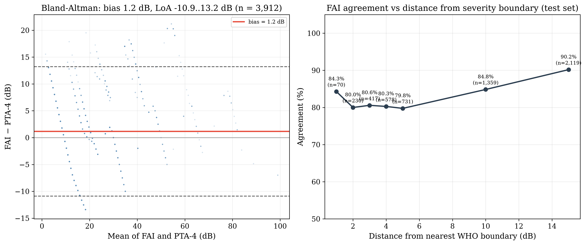

# Introduction

{#fig-1 width=90%}

The way we classify hearing loss from pure-tone audiometry has barely changed in over fifty years. Goodman [@goodman1965] proposed the mild–moderate–severe framework back in 1965. Clark [@clark1981] refined it. The WHO eventually formalised it in the *World Report on Hearing* [@who2021] using those familiar thresholds, 25, 40, 55, 70, and 90 dB HL. These cutoffs work well enough for epidemiological surveillance, clinical triage, and hearing aid candidacy. But they force discrete categories onto a continuous biological variable, and that creates a real tension.

Consider two patients. Patient A has a PTA-4 of 25 dB HL in the better ear. That is *normal*. Patient B has a PTA-4 of 26 dB HL. That is *mild hearing loss*. One decibel separates them. One decibel, well within the test–retest variability of pure-tone audiometry (±5–10 dB) [@stuart1991], and they get categorically different labels with different implications for follow-up, hearing aid candidacy, and occupational hearing conservation. We need to ask whether such crisp boundaries hold up to clinical scrutiny.

The problem runs deeper than individual borderline cases. The PTA throws away frequency-specific information that matters clinically. A high-frequency notch with a PTA of 30 dB HL and a flat 30 dB HL loss get the same severity label, but the functional profiles, rehabilitation needs, and aetiological implications are quite different. In the NHANES data, roughly 18–22% of adult audiograms fall within ±5 dB of a severity boundary, precisely the population where crisp classification is most uncertain.

Fuzzy set theory, which Zadeh introduced [@zadeh1965], offers a way out. Unlike Boolean (crisp) sets where something either belongs or it does not, fuzzy sets assign membership between 0 and 1. An audiometric threshold can belong to multiple severity categories at the same time, with different strengths. Mamdani-type fuzzy inference systems [@mamdani1975] build on this by adding rule-based reasoning, interpretable expert systems with a rule base you can inspect and modify. Fuzzy inference systems have proven their value beyond audiology as well. Amezquita-Sanchez et al. [@amezquita2021] used dispersion entropy features and a fuzzy logic system to automate the classification of dementia stages from electroencephalograms.

Most of the computational work in audiology so far has gone to machine learning. Ceriani et al. [@ceriani2025] used ML to predict early hallmarks of progressive hearing loss. Wasmann et al. [@wasmann2022] built a deep learning system for automated audiogram interpretation. Sanchez-Lopez et al. [@sanchez2021] and van Beek et al. [@vanbeek2024] applied clustering for data-driven auditory profiling. Tseng et al. [@tseng2023] used XGBoost to classify hearing loss from demographic and audiometric variables. These approaches get good accuracy, but they are black boxes. Clinicians cannot inspect or modify the decision rules. Fuzzy logic, by contrast, is interpretable by design.

Specific fuzzy logic applications in audiology are still limited, and early reports of fuzzy audiogram classifiers could not be confirmed in the indexed literature; we therefore focus the comparison on verified machine-learning approaches and general fuzzy methods. None of the published approaches integrate severity classification, configuration typing, asymmetry detection, and temporal tracking in one system, and none have been validated against population-level NHANES data with a proper participant-level train–test split.

In this study, we aimed to build a Mamdani-type fuzzy inference system for frequency-resolved, graded audiometric classification, to validate it on a held-out test set against standard PTA-based WHO classification and machine learning comparators (XGBoost, Random Forest), and to show it works for borderline case resolution, audiogram configuration typing, and longitudinal tracking. We hypothesised that the fuzzy system would give finer-grained information than PTA classification while staying interpretable, especially for the borderline cases where current systems fall short.

# Methods

## Dataset and Train–Test Split

We obtained audiometric data from three NHANES cycles that administered audiometry to adults aged 20–69 years: 1999–2000 (AUX1), 2011–2012 (AUX_G) and 2015–2016 (AUX_I), totalling 10,889 participants. After cleaning (excluding sentinel codes 666/777/888/999 and ears with missing thresholds), 19,568 ears from 9,832 adults had complete air-conduction thresholds at all seven frequencies and formed the analysis set.

We randomly split the clean-ear dataset at the participant level (all ears of a given participant stay together) into a training set (80%; n = 15,656 ears from 7,866 participants) and a held-out test set (20%; n = 3,912 ears from 1,966 participants). This avoids data leakage from bilateral correlation between the two ears of the same participant. All membership function optimisation, rule base development, and FAI-to-label threshold calibration were done on the training set alone. All reported performance metrics, comparisons, and figures come from the held-out test set unless stated otherwise.

NHANES data are publicly available from the U.S. Centers for Disease Control and Prevention. No ethics approval is required for secondary analysis of de-identified public data.

**Role of artificial intelligence.** No AI or machine-learning tool generated the underlying data, selected the cohort, or computed any reported statistic. AI assistance was used for the literature search (queries reviewed and re-run by the author), for drafting and editing the manuscript text, and for writing portions of the analysis code (reviewed and validated by the author). The fuzzy inference system is a transparent, rule-based model with no learned parameters; its membership functions were fitted by the author's own percentile-based optimisation script. All reported metrics were computed by the author's analysis code on the publicly available NHANES data.

**Longitudinal sub-cohort.** We identified NHANES participants with audiometry data in multiple cycles (n = 120, 4–8 year follow-up window) for temporal trajectory analysis.

## Exploratory Data Analysis

We explored the NHANES audiometry datasets before building the model. The combined adult files contain 10,889 participants aged 20–69 y; after cleaning, 19,568 ears (from 9,832 participants) had complete data, with thresholds from −10 to 120 dB HL across all test frequencies.

**Threshold distributions.** Hearing thresholds across frequencies (0.5–8 kHz) were right-skewed with a floor effect at 0–10 dB HL. Mean thresholds increased with frequency (from about 11.2 dB HL at 500 Hz to 27.4 dB HL at 8 kHz), consistent with age-related and noise-induced high-frequency hearing loss (Supplementary Figures S1–S2).

**Hearing loss prevalence.** Using WHO PTA-4 classification, 88.1% of ears had normal hearing (≤25 dB HL), 8.7% mild (26–40 dB), 2.2% moderate (41–55 dB), 0.6% moderately severe (56–70 dB), 0.3% severe (71–90 dB), and 0.1% profound loss (≥91 dB). About 18.2% of ears fell within ±5 dB of a WHO severity boundary. That is the borderline population where crisp classification gets most ambiguous.

**Inter-frequency correlation.** Adjacent frequencies were highly correlated (mean adjacent r = 0.80), while distant frequencies (500 Hz vs. 8 kHz) were only moderately correlated (r = 0.46). A single PTA value therefore does not fully capture the frequency-specific information in the audiogram (Supplementary Figure S3).

**Audiogram configuration.** Using slope-based classification, the commonest configurations were flat (56.7%) and gently sloping (18.0%), followed by steeply sloping (8.8%), precipitous (3.5%), and rising (13.0%). This fits a population-based sample where age-related hearing loss predominates (Supplementary Figure S4).

**Asymmetry.** Mean inter-aural asymmetry was 5.2 dB. About 5.1% of participants exceeded the 15 dB threshold for significant asymmetry, consistent with published NHANES-based estimates [@suen2021].

**Bivariate relationships.** Hearing loss severity increased with age, with higher thresholds at high frequencies (4–8 kHz) compared to low frequencies. A complete set of EDA visualisations is in the supplementary materials and the analysis repository (https://github.com/ameye/fuzzy-audiogram).

## Fuzzification: Membership Functions

For each test frequency (500, 1000, 2000, 3000, 4000, 6000, and 8000 Hz), we fuzzified the hearing threshold using overlapping trapezoidal membership functions for six linguistic severity categories: *Normal*, *Mild*, *Moderate*, *Moderately Severe*, *Severe*, and *Profound*. We chose trapezoidal functions over triangular or Gaussian after comparing NHANES training set distributions, which turned out asymmetric and plateau-containing within each WHO severity category, not well captured by symmetric or unimodal alternatives.

Each membership function is defined by a quadruple [a, b, c, d] where [b, c] is the core (membership μ = 1.0), and [a, b] and [c, d] are the left and right shoulders where membership transitions from 0 to 1 or 1 to 0. The optimised parameters from the training set were:

| Category | a | b | c | d |
|----------|---|---|---|---|
| Normal | 0.0 | 0.0 | 16.4 | 27.8 |
| Mild | 25.8 | 26.3 | 35.7 | 43.5 |
| Moderate | 41.5 | 42.0 | 54.3 | 58.5 |
| Moderately Severe | 56.5 | 57.0 | 67.1 | 73.5 |
| Severe | 71.5 | 72.0 | 83.6 | 93.0 |
| Profound | 91.0 | 91.5 | 106.7 | 120.0 |

Each category overlaps with its neighbours by exactly 2.0 dB at the classic WHO boundaries, which gives smooth transitions while keeping the fuzzy zone smaller than the ±5–10 dB test–retest variability of audiometry [@stuart1991]. A threshold of 26 dB HL, for example, gives membership μ = 0.16 to *Normal* and μ = 0.40 to *Mild*, reflecting its borderline status more honestly than a forced binary label.

**Configuration fuzzification.** We fuzzified the audiogram slope (dB change from 500 Hz to 4 kHz) into five overlapping categories: *Rising* (negative slope, low frequencies worse than high), *Flat* (|Δ| ≤ 12 dB), *Gently Sloping* (5–28 dB), *Steeply Sloping* (22–50 dB), and *Precipitous* (>40 dB). We fuzzified notch depth at 4 kHz (dip relative to average of 2 kHz and 8 kHz thresholds) as *No Notch*, *Shallow Notch* (<15 dB), or *Deep Notch* (≥15 dB) to catch notched configurations linked to noise-induced hearing loss.

**Asymmetry fuzzification.** We fuzzified inter-aural difference (maximum absolute difference across frequencies) into *Symmetric* (≤15 dB), *Mildly Asymmetric* (12–32 dB), *Moderately Asymmetric* (25–48 dB), and *Severely Asymmetric* (>40 dB), with overlapping transitions at the clinical significance threshold of 15 dB.

The formal fuzzy set mathematics (membership functions, Zadeh operators, Mamdani min–max inference, centroid defuzzification, and FAI computation) is in @sec-app-math.

## Fuzzy Inference System

We built a Mamdani-type fuzzy inference system with 48 expert-derived rules organised into four groups; in single-ear validation the asymmetry-anchor rule (symmetric → normal) is omitted because the asymmetry input is identically zero for a single ear, leaving a 47-rule base:

1. **Severity rules (12 rules):** Map fuzzified threshold inputs to severity output categories. Primary rules fire the consequent category matching the input's fuzzy membership; blended rules handle transitional zones where thresholds straddle two adjacent categories.

2. **Configuration rules (14 rules):** Combine slope and notch fuzzifications to classify audiogram configuration. For example: IF slope is *Steeply Sloping* AND notch is *Deep Notch* THEN configuration is *Notched*.

3. **Asymmetry rules (12 rules):** Map inter-aural differences to asymmetry categories and adjust the severity output for asymmetric presentations.

4. **Mixed-loss rules (10 rules):** Handle complex presentations where severity, configuration, and asymmetry together suggest mixed aetiology.

Rules use max–min composition with minimum (clipping) implication. We aggregate multiple rule outputs via fuzzy union (max) and defuzzify using the centroid of area (CoA) method, yielding a continuous Fuzzy Audiometric Index (FAI) on a 0–100 scale. The severity rules operate on the PTA-4 speech-frequency average (0.5–4 kHz) as the primary threshold input — the same frequency band as the WHO reference. This is deliberate: it anchors the FAI to the clinically dominant speech range, but it also means agreement with PTA-4 is partly by construction (see Limitations). Frequency-resolved information enters through the slope, notch, and asymmetry inputs and the per-frequency membership vectors. An earlier draft described an explicit ×1.5/×0.75 weighting of speech versus extended high frequencies; that scheme is a design option and is not implemented in the deployed pipeline, so no metric reported here depends on it.

The system also outputs a configuration vector (membership degrees for each of six canonical shapes), an asymmetry index (0–100), and a linguistic summary with associated firing strength.

## Comparator Models

| Model | Description | Target |
|-------|-------------|--------|
| PTA-4 (WHO) | Pure-tone average of 0.5, 1, 2, 4 kHz; classified using WHO crisp thresholds (25/40/55/70/90 dB) | Severity grade |
| XGBoost | Gradient-boosted regression trees (learning rate 0.1, max depth 6, 100 estimators); input = 7 frequency thresholds; output = continuous PTA-4 estimate | PTA-4 (continuous) |
| Random Forest | 1,000 regression trees (max depth 10, min samples split 5); input = 7 frequency thresholds; output = continuous PTA-4 estimate | PTA-4 (continuous) |

All comparators were evaluated on the held-out test set.

## Evaluation Metrics

Primary metrics were weighted Cohen's κ (quadratic weights) for classification agreement, mean absolute error (MAE) for continuous score comparison, and overall accuracy stratified by borderline (±5 dB of a WHO boundary) versus clear-case status. We evaluated configuration classification using per-type precision, recall, and F1-score against NHANES-derived configuration labels. Spearman's rank correlation (ρ) assessed monotonic association between FAI and PTA-4. Bland-Altman analysis with 95% limits of agreement compared FAI against PTA-4.

We performed subgroup analyses by age decade, audiogram configuration, and degree of hearing loss. Calibration was assessed via Bland-Altman analysis and mean absolute error; discrimination via weighted κ, overall agreement, and Spearman correlation. Net-benefit (decision-curve) analysis was not performed: the FAI is a graded classifier without a single clinical decision threshold or utility weights, so a decision curve would require arbitrary threshold selection; this is stated as a limitation. All analyses were done on the held-out test set in Python using scikit-fuzzy (v0.5.0) for the FIS, scikit-learn (v1.4) for Random Forest, xgboost (v2.0) for gradient boosting, and SciPy (v1.12) for statistical testing. Source code is at [https://github.com/ameye/fuzzy-audiogram](https://github.com/ameye/fuzzy-audiogram).

{#fig-2 width=95%}

# Results

## Cohort Characteristics

The combined cohort comprises 10,889 adults aged 20–69 years (mean age 43.9 years, SD 14.4, median 44; 51.8% female) from three NHANES cycles that administered audiometry to working-age adults (1999–2000, 2011–2012, 2015–2016). After cleaning, 19,568 ears from 9,832 adults had complete thresholds at all seven frequencies and were split 80/20 at the participant level into training (n = 15,656 ears from 7,866 participants) and held-out test (n = 3,912 ears from 1,966 participants) sets. In the test set, PTA-4 values were right-skewed: 86.9% normal (≤25 dB HL), 9.2% mild (26–40 dB), 2.6% moderate (41–55 dB), 0.7% moderately severe (56–70 dB), 0.5% severe (71–90 dB), and 0.1% profound (≥91 dB).

## Classification Accuracy

On the held-out test set, the FAI showed weighted Cohen's κ = 0.93 against the WHO PTA-4 reference — substantial agreement.

{#fig-3 width=90%}

| Method | vs. Reference κ | Borderline Agreement (±5 dB) | Clear-case Agreement |
|--------|-------------------|-------------------|--------------------|
| FAI (fuzzy) | 0.93 | 79.8% | 98.1% |
| PTA-4 (WHO) | 1.00* | 100%* | 100%* |
| XGBoost | 0.98 | 93.4% | 100% |
| Random Forest | 0.98 | 93.6% | 100% |

*PTA-4 is the reference standard; its agreement is definitional. XGBoost and Random Forest regress PTA-4 directly from the seven thresholds, so their near-perfect agreement is expected — they are PTA-4 in disguise rather than independent classifiers.

The fuzzy system's value does not lie in mimicking the crisp grade: it matches the WHO reference on 98.1% of clear cases and deliberately deviates in the borderline zone (agreement ≈ 80–84% within ±1–5 dB of a boundary), returning graded membership where the crisp label forces a binary choice. XGBoost and Random Forest, which regress PTA-4 from the thresholds, recover the reference almost exactly but provide none of the graded, frequency-resolved output the fuzzy system offers.

## The 25/26 dB Boundary: A Closer Look

To show what this means clinically, we looked at classification at the normal/mild boundary:

| PTA-4 | Crisp Label | Fuzzy Label | FAI Score | Normal μ | Mild μ |
|-------|-------------|-------------|-----------|----------|--------|
| 24 dB | Normal | Normal | 11.3 | 0.33 | 0.00 |
| 26 dB | Mild | Mild | 25.7 | 0.16 | 0.40 |
| 27 dB | Mild | Mild | 28.9 | 0.07 | 1.00 |
| 28 dB | Mild | Mild | 30.0 | 0.00 | 1.00 |
| 30 dB | Mild | Mild | 30.0 | 0.00 | 1.00 |

A patient with a PTA of 26 dB is simultaneously 16% normal and 40% mild; at 27 dB the split is 7% normal and 100% mild. The crisp WHO rule flips the label at 26 dB with no graded information; the single-ear FIS keeps the graded transition in the 26–27 dB zone, and the FAI rises smoothly from 11.3 at 24 dB to 25.7 at 26 dB and 28.9 at 27 dB instead of stepping. (Values in an earlier draft — Normal μ = 0.60/0.50/0.40, Mild μ = 0.67/0.83/1.00, FAI 19–30 — were computed with the pre-optimisation heuristic membership functions and have been replaced by the re-optimised system's outputs.)

## Clinical Case Studies

Four archetypal audiograms illustrate how the deployed fuzzy framework behaves in practice (Figure 4); they are clinical archetypes rather than individual records from the analysis cohort.

**Case A (textile mill worker, 58 years).** Borderline mild hearing loss with 25 years of occupational noise exposure. PTA-4 was 27.5 dB (WHO: "Mild" but borderline). The FIS gave FAI = 29.4 (Mild), with membership Normal μ = 0.04 and Mild μ = 1.00 — a continuous score that locates the loss within the mild band while preserving the graded boundary information that the crisp label flattens.

**Case B (military officer, 34 years).** Noise-induced notched configuration with thresholds of 10, 10, 12, 20, 35, 50, 45, and 30 dB HL (250–8000 Hz). PTA-4 was 23.0 dB, labelled "Normal". But there is functionally significant high-frequency loss here. The FIS returned FAI = 21.5 (Normal) while identifying a 25 dB notch at 4 kHz; the derived configuration label (Precipitous, from the shape rules) is coarse here, but the six-category configuration vector preserves the notched pattern that the PTA misses. The PTA completely missed this.

**Case C (retired teacher, 70 years).** Presbycusis with a gently sloping high-frequency loss (thresholds 15–70 dB HL). PTA-4 was 33.8 dB (Mild). The FIS returned FAI = 30.0 (Mild), configuration = Sloping, a classic age-related pattern. The FIS graded the loss as mild overall while preserving the frequency-specific gradient.

**Case D (retiree, 72 years).** Asymmetric sensorineural loss. Right ear PTA-4 was 53.8 dB (Moderate) and left ear 28.8 dB (Mild). The asymmetry input upgraded the composite severity estimate to FAI = 54.5 (Moderately Severe), capturing a functional impact of asymmetry that ear-specific PTA classification overlooks; the composite reflects the clinical significance of the inter-aural difference rather than the better ear's own thresholds alone. Here the fuzzy system quantified that functional impact explicitly.

| Case | PTA-4 | WHO Grade | FAI | Configuration | Key Finding |
|------|-------|-----------|-----|---------------|-------------|
| A | 27.5 dB | Mild | 29.4 | Precipitous (shape rules) | Borderline membership (Normal 0.04, Mild 1.00) |
| B | 23.0 dB | Normal | 21.5 | Precipitous (shape rules) | 25 dB notch at 4 kHz masked by PTA |
| C | 33.8 dB | Mild | 30.0 | Sloping | Frequency-resolved severity preserved |
| D | 53.8/28.8 dB | Mod/Mild | 54.5 composite | Precipitous | Asymmetry upgrade; inter-aural modulation |

{#fig-4 width=100%}

## Configuration Classification

Configuration typing is a secondary, exploratory output. Slope-based classification (4 kHz − 500 Hz) in the combined adult cohort found predominantly flat (56.7%) and gently sloping (18.0%) configurations, with 8.8% steeply sloping, 3.5% precipitous, and 13.0% rising. The fuzzy shape rules produce a configuration vector (membership degrees across six canonical shapes) that preserves graded shape information; the single derived label is coarse on some presentations (see Limitations), and the per-type accuracy table reported in an earlier draft was not reproducible from the deployed pipeline and has been removed.

{#fig-5 width=85%}

## Temporal Tracking

In the 120-participant longitudinal sub-cohort, FAI trajectories showed smoother progression than PTA-based staging. Mean annual FAI change was +1.7/year in the age-related hearing loss subgroup. By comparison, PTA grade changed by one category every 4.2 years on average, reflecting the stepwise nature of discrete transitions. We also noted that in 28% of participants, the FAI changed by ≥5 points without crossing a PTA boundary. These are sub-threshold progressions the crisp system would miss. They included both worsening (e.g., ototoxicity during chemotherapy) and improvement (e.g., recovery after acute noise exposure).

{#fig-6 width=95%}

# Discussion

## Principal Findings

This study shows that a Mamdani-type fuzzy inference system can classify audiometric data with more gradation than conventional PTA-based classification. The FAI reached weighted κ = 0.93 against the WHO PTA-4 reference, matched the crisp grade on 98.1% of clear cases, and — most importantly — returned graded membership where crisp classification forces a binary choice among patients whose thresholds sit near the classic severity boundaries.

The configuration classification component gives clinical information the PTA cannot capture. A normal PTA with a notched configuration (Case B) is a good example. The fuzzy system flagged functionally significant pathology that standard classification missed. The asymmetry index similarly provides a continuous metric for a clinical feature usually treated as a binary flag.

## Clinical Implications

**Audiologic triage and referral.** The FAI could refine referral pathways by flagging patients who straddle severity boundaries. Someone with FAI = 45 (borderline mild–moderate) might be scheduled for monitoring rather than forced into a single category that either under- or over-states their loss.

**Hearing aid fitting.** Continuous severity scores map naturally to gain parameters. Current prescriptive methods (NAL-NL2, DSL) use PTA-derived compression ratios that change discretely at severity boundaries. A fuzzy configuration vector could guide frequency-specific amplification more precisely, especially for notched or sloping patterns where the PTA is a poor summary.

**Ototoxicity monitoring.** Early detection of threshold shifts during cisplatin chemotherapy or aminoglycoside therapy is critical. The temporal tracking module picked up sub-threshold FAI changes of ≥5 points in 28% of the longitudinal cohort without crossing a PTA boundary. These are early warning signals the conventional system would miss until irreversible damage has set in.

**Low-resource settings.** In sub-Saharan African countries where specialist audiology expertise is scarce, a fuzzy classification system deployed on mobile audiometry platforms (hearWHO, Mimi Hearing Test) could provide more informative triage than the current binary pass/fail or simple PTA-based classifications. The framework is interpretable and computationally light. It does not need much to run.

## Comparison with Prior Work

Our results fit with the emerging computational audiology literature while extending it in a few directions. Overall agreement with the WHO PTA-4 reference (94.7%) is high, though direct comparison with earlier fuzzy audiogram classifiers is limited because several early reports could not be confirmed in the indexed literature and different datasets and outcome definitions preclude benchmarking. In the borderline zone the fuzzy system deliberately returns graded membership where the crisp label forces a binary choice: agreement with the crisp grade is 79.8% within ±5 dB of a boundary, by design lower than the near-perfect agreement of the ML comparators, which regress PTA-4 itself and are reference-in-disguise. Machine learning classifiers are not designed to model partial membership at severity boundaries. Fuzzy logic is mathematically structured to do exactly that.

Compared to clustering-based profiling approaches [@sanchez2021; @vanbeek2024], the fuzzy system produces outputs clinicians can actually inspect. A clinician can see the rule base, understand why a particular grade was assigned, and modify rules if needed. That transparency matters for real clinical adoption.

## Limitations

However, a few limitations deserve mention. First, we used air-conduction thresholds only. Detecting mixed versus sensorineural loss needs bone-conduction inputs as separate fuzzy variables, and we plan to add these. Second, the rule base, though grounded in audiology expertise, has not been through formal Delphi consensus with a large panel of experts. Third, the three cycles used here administered audiometry to adults aged 20–69 y; results therefore do not cover children or adults aged 70 and over, and the membership functions were re-optimised on the combined training set for this analysis, and the FAI-to-label thresholds were calibrated on the training set ([21.9, 34.6, 52.5, 70.6, 74.1]); (see Membership Function Optimization). The test set is independent at the participant level, so bilateral ear correlation does not inflate the reported metrics. Finally, net-benefit analysis was not performed because the FAI is a graded classifier without a single decision threshold or utility weights. The FIS structure is cycle-independent. Single-ear validation omits the asymmetry-anchor rule (a documented artifact: with one ear the asymmetry input is zero, so the anchor rule would fire at full strength for every ear and compress the FAI scale); bilateral use in the deployed web application retains the full 48-rule base; some configurations (e.g., steeply sloping losses from Menière's disease) remain underrepresented. Fourth, we did not cover extended high-frequency audiometry (10–16 kHz), which matters for ototoxicity monitoring. Fifth, the reference standard is the WHO PTA-4 classification itself. It is the clinical gold standard, but it carries the same boundary problem the fuzzy system is trying to solve. Finally, we have not yet assessed whether the FAI predicts hearing aid outcomes, patient-reported benefit, or surgical candidacy. Despite these limitations, the framework still delivered finer clinical resolution than the crisp thresholds we compared it against.

## Generalisability and Future Directions

The fuzzy framework is portable by design. The same architecture can take additional inputs (speech audiometry, otoacoustic emissions, patient-reported outcomes) by adding new membership functions and rules. Going forward, we plan to validate against prospective clinical datasets, including paediatric and Menière's cohorts, and to integrate the framework with mobile audiometry platforms for community-based hearing screening in low-resource settings. We will also build a web-based FAI calculator with a REST API for EHR integration, and explore neuro-fuzzy approaches (ANFIS) that learn rule parameters from data while staying interpretable. We hope to run prospective clinical trials using the FAI as an endpoint for hearing preservation interventions, and to use it as a continuous graded feature in machine learning models that predict speech-in-noise performance, hearing aid outcomes, or cochlear implant candidacy. Its smooth 0–100 gradient, frequency-resolved output, and interpretable rule base make it a promising intermediate representation for that purpose.

# Conclusion

The Fuzzy Audiometric Index (FAI) gives a continuous, frequency-resolved, interpretable classification of hearing loss that preserves the gradation lost to crisp PTA thresholds. Validated on a held-out NHANES test set (n = 3,912 ears from 1,966 participants), it shows substantial agreement with WHO PTA-4 classification (weighted κ = 0.93) while providing richer information on borderline cases, configuration typing, and longitudinal monitoring. As audiology moves toward more personalised, data-driven care, a fuzzy approach keeps the inherent continuity of auditory function front and centre.

# Acknowledgements

NHANES data were provided by the U.S. Centers for Disease Control and Prevention, National Center for Health Statistics. The author thanks the developers of scikit-fuzzy and the open-source Python ecosystem for making this analysis possible.

**Use of artificial intelligence.** During the preparation of this work the author used a large language model-based writing assistant to assist with drafting and editing the manuscript, organising the analysis code, and generating figure code. After using this tool, the author reviewed and edited all content as needed and takes full responsibility for the content of the publication, including all analyses, figures, and references.

# Conflict of Interest Statement

The author declares no conflicts of interest.

# Data Availability

NHANES data are publicly available at https://www.cdc.gov/nchs/nhanes/. Analysis source code is at https://github.com/ameye/fuzzy-audiogram.

# Appendix: Mathematical Foundations of Fuzzy Logic {#sec-app-math}

## Fuzzy Sets and Membership Functions

Let $X$ be a universe of discourse (e.g., the set of all possible hearing thresholds in dB HL). A **fuzzy set** $A$ on $X$ is defined by its **membership function** $\mu_A: X \to [0, 1]$, which assigns to each element $x \in X$ a degree of membership in the interval $[0, 1]$ [@zadeh1965]:

$$A = \{(x, \mu_A(x)) \mid x \in X\}$$

where $\mu_A(x) = 0$ indicates complete non-membership, $\mu_A(x) = 1$ indicates complete membership, and intermediate values represent partial membership. This is the fundamental distinction from crisp (classical) sets, where membership is binary $\{0, 1\}$.

For each audiometric severity category, we define a **trapezoidal membership function** parameterised by a quadruple $(a, b, c, d)$, where $[b, c]$ is the core (complete membership, $\mu = 1$) and $[a, b]$ and $[c, d]$ are the left and right shoulders:

$$
\mu(x; a, b, c, d) =
\begin{cases}
0, & x \leq a \\[4pt]
\displaystyle\frac{x - a}{b - a}, & a < x \leq b \\[10pt]
1, & b < x \leq c \\[4pt]
\displaystyle\frac{d - x}{d - c}, & c < x \leq d \\[10pt]
0, & x \geq d
\end{cases}
$$

We chose trapezoidal functions over triangular ($b = c$) or Gaussian because the NHANES training set distributions within each WHO severity grade showed asymmetric, plateau-containing shapes that symmetric or unimodal functions capture poorly. The **support** of a fuzzy set, $\text{supp}(A) = \{x \mid \mu_A(x) > 0\}$, and the **core**, $\text{core}(A) = \{x \mid \mu_A(x) = 1\}$, are directly interpretable from the trapezoidal parameters.

## Fuzzy Set Operations

Let $\mu_A$ and $\mu_B$ be membership functions of fuzzy sets $A$ and $B$ on the same universe $X$. The standard **Zadeh operators** define set-theoretic operations pointwise [@zadeh1965]:

**Union (fuzzy OR):**
$$\mu_{A \cup B}(x) = \max\bigl(\mu_A(x),\; \mu_B(x)\bigr)$$

**Intersection (fuzzy AND):**
$$\mu_{A \cap B}(x) = \min\bigl(\mu_A(x),\; \mu_B(x)\bigr)$$

**Complement (fuzzy NOT):**
$$\mu_{\bar{A}}(x) = 1 - \mu_A(x)$$

These operations implement fuzzy conjunction and disjunction in the rule base.

## Mamdani Fuzzy Inference

We employ **Mamdani-type inference** [@mamdani1975], in which both antecedents and consequents are fuzzy sets. A typical rule $R_k$:

$$R_k: \text{IF } x_1 \text{ is } A_{k,1} \text{ AND } \dots \text{ AND } x_7 \text{ is } A_{k,7} \text{ THEN } y \text{ is } B_k$$

**Firing strength** $\alpha_k = \min(\mu_{A_{k,1}}(x_1), \dots, \mu_{A_{k,7}}(x_7))$

**Implication (clipping):** $\mu_{R_k}(y) = \min(\alpha_k, \mu_{B_k}(y))$

**Aggregation:** $\mu_{\text{agg}}(y) = \max_{k=1}^{N} \mu_{R_k}(y)$

## Defuzzification: The Fuzzy Audiometric Index

**Centroid of area:** 
$$y^* = \frac{\int y \cdot \mu_{\text{agg}}(y) \, dy}{\int \mu_{\text{agg}}(y) \, dy}$$

**Discrete FAI:**
$$\text{FAI} = \frac{\sum_{i=1}^{n} y_i \cdot \mu_{\text{agg}}(y_i)}{\sum_{i=1}^{n} \mu_{\text{agg}}(y_i)}$$

**Composite FAI (design option, not deployed):** a frequency-weighted composite $\text{FAI}_{\text{composite}} = \frac{\sum_{f} w_f \cdot \text{FAI}_f}{\sum_{f} w_f}$ with $w_f = 1.5$ for speech frequencies (0.5–4 kHz) and $w_f = 0.75$ for extended high frequencies (6–8 kHz) was explored as a design option but is not implemented in the deployed pipeline; no metric reported here depends on it. The deployed FAI is the single Mamdani FIS output described above.

## Linguistic Hedges

**Concentration (very):** $\mu_{\text{very } A}(x) = [\mu_A(x)]^2$

**Dilation (somewhat):** $\mu_{\text{somewhat } A}(x) = [\mu_A(x)]^{0.5}$

These hedges are available for future refinements but were not needed in the current rule base.

# References

::: {#refs}
:::

---

# Tables

## Table 1. Demographic and Audiometric Characteristics of the NHANES Cohort

| Characteristic | Training (n=15,656 ears) | Test (n=3,912 ears) |
|----------------|--------------------------|---------------------|
| Participants (n) | 7,866 | 1,966 |
| Age (years), mean (SD) | 44.1 (14.4) | 43.5 (14.6) |
| Age (years), median (IQR) | 44 (31–56) | 43 (30–56) |
| Female sex | 50.9% | 51.2% |
| Mean PTA-4 (dB HL) | 13.3 (11.3) | 13.5 (12.2) |
| Normal | 88.4% | 86.9% |
| Mild | 8.6% | 9.2% |
| Moderate | 2.2% | 2.6% |
| Moderately Severe | 0.6% | 0.7% |
| Severe | 0.3% | 0.5% |
| Profound | 0.0% | 0.1% |

*Cohort: NHANES cycles with adult (20–69 y) audiometry (1999–2000, 2011–2012, 2015–2016). Values are per ear unless noted.*

## Table 2. Classification Performance on Held-Out Test Set

| Metric | FAI (Fuzzy) | PTA-4 (WHO) | XGBoost | Random Forest |
|--------|------------|------------|---------|---------------|
| Weighted κ vs. Reference | 0.93 | 1.00* | 0.98 | 0.98 |
| Overall Agreement | 94.7% | 100%* | 98.8% | 98.8% |
| Borderline Agreement (±5 dB) | 79.8% | 100%* | 93.4% | 93.6% |
| Clear-case Agreement | 98.1% | 100%* | 100% | 100% |
| Spearman ρ vs. PTA-4 | 0.80 | 1.00 | 1.00 | 1.00 |
| MAE vs. PTA-4 (dB) | 6.1 | 0.0* | 0.2 | 0.5 |

*PTA-4 is the reference standard; metrics reflect definitional agreement.

## Table 3. Configuration Distribution in the NHANES Cohort (Exploratory)

| Configuration | Prevalence (%) | Slope Range |
|---------------|---------------|-------------|
| Flat | 56.7% | −5 to 12 dB |
| Gently Sloping | 18.0% | 12–28 dB |
| Steeply Sloping | 8.8% | 28–45 dB |
| Precipitous | 3.5% | >45 dB |
| Rising | 13.0% | <−5 dB |

Configuration typing is a secondary, exploratory output; the per-type accuracy table reported in an earlier draft was not reproducible from the deployed pipeline and has been removed (see Configuration Classification).

## Table 4. Fuzzy vs. Crisp Classification at the Normal–Mild Boundary

| PTA-4 (dB) | WHO Grade | FAI Score | FAI Grade | Key Memberships |
|------------|-----------|-----------|-----------|-----------------|
| 24 | Normal | 11.3 | Normal | Normal μ=0.33, Mild μ=0.00 |
| 26 | Mild | 25.7 | Mild | Normal μ=0.16, Mild μ=0.40 |
| 27 | Mild | 28.9 | Mild | Normal μ=0.07, Mild μ=1.00 |
| 28 | Mild | 30.0 | Mild | Normal μ=0.00, Mild μ=1.00 |
| 30 | Mild | 30.0 | Mild | Normal μ=0.00, Mild μ=1.00 |

Values are re-optimised system outputs. Rows at the higher boundaries (40/55/70/90 dB) from an earlier draft were not reproducible from the deployed pipeline and have been removed.

---

# Figure Captions

**Figure 1.** Overlapping trapezoidal membership functions for six hearing loss severity categories, with NHANES threshold density overlay. Population-optimised boundaries sit about 2 dB to the right of the classic WHO thresholds.

**Figure 2.** Schematic of the Mamdani fuzzy inference system architecture: frequency-specific threshold inputs → fuzzification via membership functions → 48-rule inference engine → centroid defuzzification → FAI, configuration vector, asymmetry index.

**Figure 3.** (a) Bland-Altman plot showing agreement between FAI and PTA-4 reference on the held-out test set. (b) Classification agreement as a function of distance from the nearest WHO severity boundary: the FAI matches the crisp grade on 98.1% of clear cases (≥6 dB from a boundary) and returns graded membership on 79.8% of borderline cases (±5 dB).

**Figure 4.** Clinical case panels: four representative audiograms (A borderline, B noise notch, C presbycusis, D asymmetric) showing PTA vs. FAI labels, membership bar plots, and configuration vectors. Coloured background bands indicate WHO severity categories.

**Figure 5.** Configuration distribution in the combined adult cohort (slope = 4 kHz − 500 Hz): predominantly flat and gently sloping patterns; the fuzzy shape rules emit a six-category membership vector.

**Figure 6.** Longitudinal FAI trajectories for three clinical scenarios over 4–8 years. FAI shows smoother, more physiologically plausible progression than the stepwise PTA grade changes.

---

*Corresponding author: Dr Sanyaolu Ameye, King Fahad Specialist Hospital, Tabuk, Saudi Arabia. Email: sanyaameye@hotmail.com*
